# BotEnergy — Production Arxitektura Dizayni

> Status: dizayn taklifi (implementatsiya qilinmagan). Versiya 1.0 — 2026-08-07.
> Muallif roli: Principal Solution Architect / Senior .NET Architect / Cloud & DevOps.
> Domen `company.uz` — placeholder, haqiqiy domen bilan almashtiriladi.

---

## 0. Boshlang'ich holat va farazlar

### 0.1 Hozirgi holat (kod bazasidan aniqlangan)

| Element | Hozir | Manba |
|---|---|---|
| 7 ta Web API | AdminApi 5001, AuthApi 5002, BillingApi 5003, DeviceApi 5004, PaymentApi 5005, UserApi 5006, SessionApi 5007 | `ConfigurationFile/Configuration.json` |
| Public kirish | Har bir servis IP:Port bilan ochiq (`http://51.38.127.221:500X`) | `Cors:AllowedOrigins` |
| TLS | Yo'q (`Hosting:UseHttps: false`) | `Configuration.json` |
| Gateway | Yo'q — YARP/Nginx repo'da umuman yo'q | grep natijasi |
| MQTT | Tashqi broker, `localhost:8883`, TLS, **bitta umumiy** `botenergy-device` login | `Configuration.Production.json` |
| MQTT pipeline | SessionApi ichida: Deserialize → DeviceAuth → HMAC → Timestamp → Replay → Dispatcher | `WebApi/SessionApi/Mqtt/` |
| SignalR | SessionApi `/hubs/session`, JWT `access_token` query-string qo'llab-quvvatlanadi | `SessionApi/Program.cs:58,82` |
| RabbitMQ | **Olib tashlangan** — device messaging faqat MQTT | `CLAUDE.md` |
| DB | Bitta PostgreSQL + PostGIS, migration har bootda avtomatik | `AddInfrastructure` |
| Redis | Refresh token, idempotency, MQTT replay counter | `AddRedisServices` |
| Logging | Serilog → console + `../logs/{Api}-YYYYMMDD.log` | `LoggingExtensions.cs` |
| Health | Har API'da bitta `/health` (DB + Redis) | `AddInfrastructure` |
| Deploy | GitHub Actions self-hosted runner → `deploy.sh` → prod mashinada `dotnet publish` → systemd restart | `.github/workflows/deploy.yml` |

### 0.2 Darhol tuzatilishi kerak bo'lgan 5 ta nuqta

Bular arxitekturaga bog'liq emas — hozirgi kodda mavjud va yangi dizaynga o'tishdan **oldin** hal qilinishi kerak:

1. **Production secretlar git'da.** `Infrastructure/CommonConfiguration/ConfigurationFile/Configuration.Production.json` git'da kuzatilmoqda (`git ls-files` tasdiqladi) va ichida haqiqiy DB paroli, JWT secret, MQTT paroli, `InternalApi:SharedSecret` bor. `CLAUDE.md` bu fayl `Env_*` placeholder tutadi deb yozadi — real fayl bunday emas. → **Barcha secretlarni rotatsiya qiling**, faylni placeholder'ga o'tkazing, git history'dan tozalang (`git filter-repo`).
2. **`Otp:AllowTestCode: true` production'da.** Test kodi `123456` bilan istalgan raqamga login qilish mumkin. → `false`.
3. **`Seed:AdminPassword: "Admin@123"` production'da.** → env var, kuchli parol.
4. **MQTT'da bitta umumiy device credential.** Bitta qurilma buzib ochilsa, barcha qurilmalar nomidan publish qilish mumkin (HMAC ikkinchi qatlam himoya beradi, lekin broker darajasida to'siq yo'q). → per-device credential + ACL (§6.4).
5. **`/health` liveness sifatida ishlatilsa restart loop xavfi.** DB yoki Redis vaqtincha yiqilsa health fail bo'ladi va orchestrator konteynerni cheksiz restart qiladi. → `/health/live` (jarayon tirikmi) va `/health/ready` (bog'liqliklar joyidami) ajratilsin (§11.3).

### 0.3 Dizayn farazlari

- Bitta asosiy domen: `company.uz`. Subdomenlar qo'shish mumkin, lekin majburiy emas.
- Boshlanish nuqtasi — **bitta Ubuntu VPS**, 1–3 yil ichida 2–4 node'gacha o'sish.
- Maqsadli yuk: 100 000 ro'yxatdan o'tgan foydalanuvchi, 2 000–5 000 bir vaqtdagi mobil klient, 3 000–10 000 MQTT qurilma.
- Jamoa kichik (1–3 backend dev) → operatsion murakkablik **eng muhim cheklov**. Kubernetes hozir emas.
- `DateTime.Now` + local time, soft delete, single-DB — loyiha qarorlari, o'zgartirilmaydi.

---

## 1. Umumiy arxitektura diagrammasi

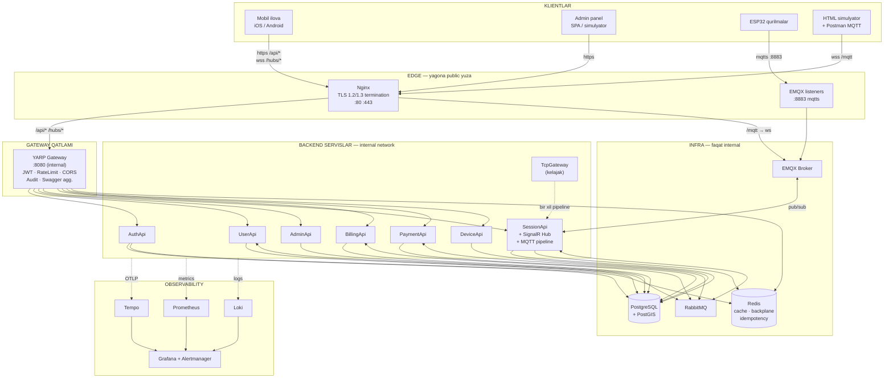

**O'qish kaliti:** faqat `edge` bloki public IP'da tinglaydi. `gw`, `svc`, `infra` — Docker internal tarmoq, host'ga chiqmaydi (yoki `127.0.0.1` ga bind qilingan).

---

## 2. Tarmoq diagrammasi

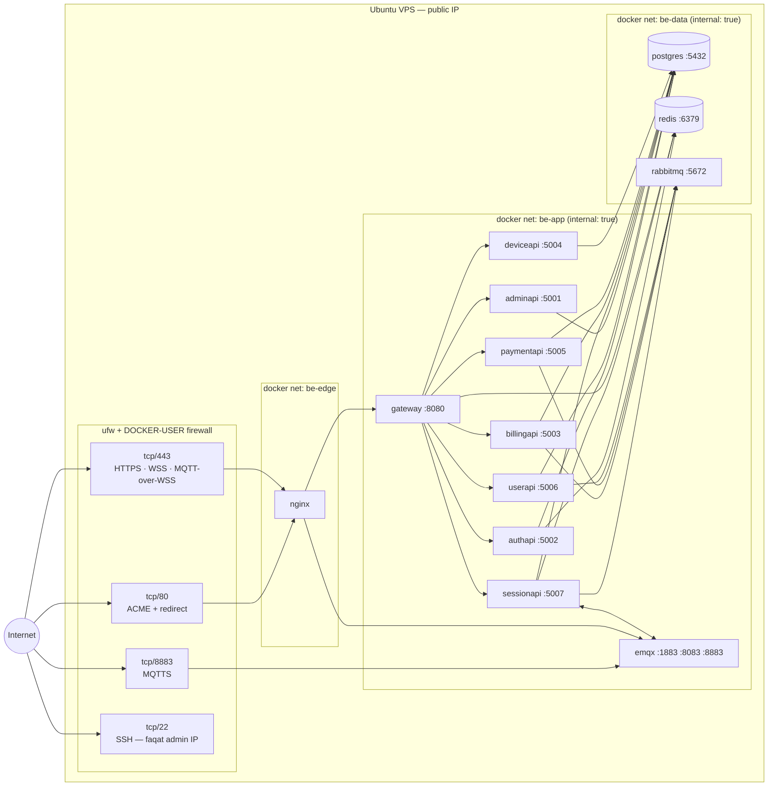

### 2.1 Port jadvali

| Port | Yo'nalish | Kim ishlatadi | Ochiqmi | Izoh |
|---|---|---|---|---|
| 22 | inbound | SSH | **Cheklangan** | Faqat admin IP whitelist; parol o'chirilgan, faqat kalit |
| 80 | inbound | Let's Encrypt ACME + 301 redirect | Ochiq | Boshqa hech narsa |
| 443 | inbound | `https://` API, `wss://` SignalR, `wss://` MQTT | Ochiq | Nginx TLS termination |
| 8883 | inbound | ESP32 → EMQX MQTTS | Ochiq | Broker o'zi TLS terminate qiladi |
| 8080 | internal | Nginx → YARP | Yopiq | docker net `be-app` |
| 5001–5007 | internal | YARP → servislar | Yopiq | Hech qachon publish qilinmaydi |
| 1883 | internal | Plain MQTT | **Yopiq** | Faqat internal test uchun; prodda o'chiriladi |
| 8083 | internal | EMQX WS listener | Yopiq | Nginx orqali `/mqtt` |
| 5432 | internal | PostgreSQL | Yopiq | `be-data` |
| 6379 | internal | Redis | Yopiq | `be-data` |
| 5672 / 15672 | internal | RabbitMQ / management UI | Yopiq | UI — SSH tunnel orqali |
| 18083 | internal | EMQX dashboard | Yopiq | SSH tunnel orqali |
| 3000 / 9090 | internal | Grafana / Prometheus | Yopiq | SSH tunnel yoki VPN |

> **Docker + ufw tuzog'i:** `docker run -p 5432:5432` ufw qoidalarini **aylanib o'tadi** (Docker `DOCKER-USER` chain'iga o'zi NAT yozadi). Shuning uchun compose'da hech qachon `"5432:5432"` yozmang — yo umuman `ports` bermang (faqat `expose`), yo `"127.0.0.1:5432:5432"` deb bind qiling.

---

## 3. So'rov oqimlari (request flow)

### 3.1 REST — mobil ilova sessiya boshlaydi

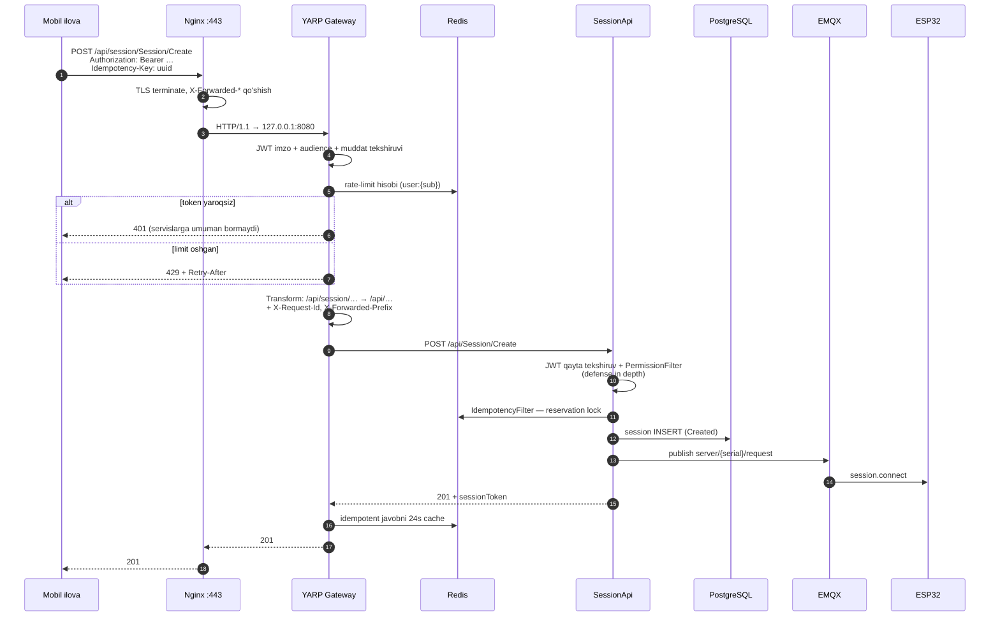

**Muhim qoida:** Gateway JWT'ni **tekshiradi**, lekin **permission tekshirmaydi**. Permission `{Controller}.{Action}` konvensiyasidan route'dan olinadi — buni faqat servis o'zi biladi. Gateway'da autentifikatsiya (kimsan), servisda avtorizatsiya (nima qila olasan).

### 3.2 SignalR — real-time telemetriya

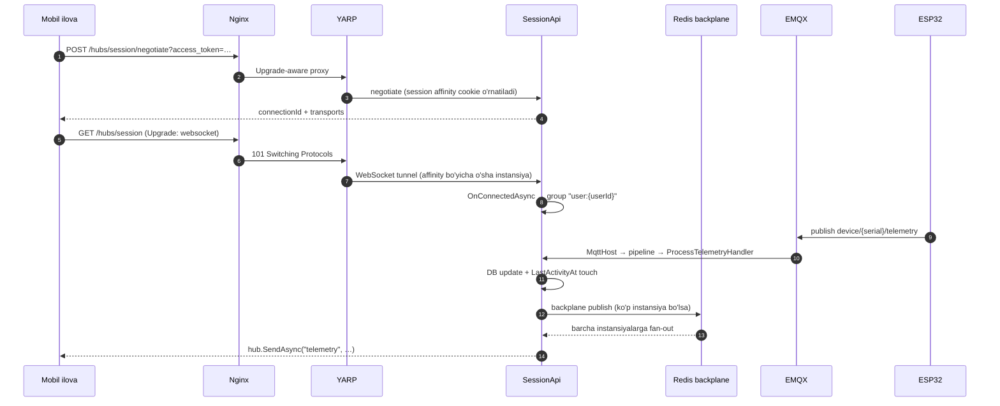

### 3.3 MQTT — qurilma javobi (to'liq oqim §6.5 da)

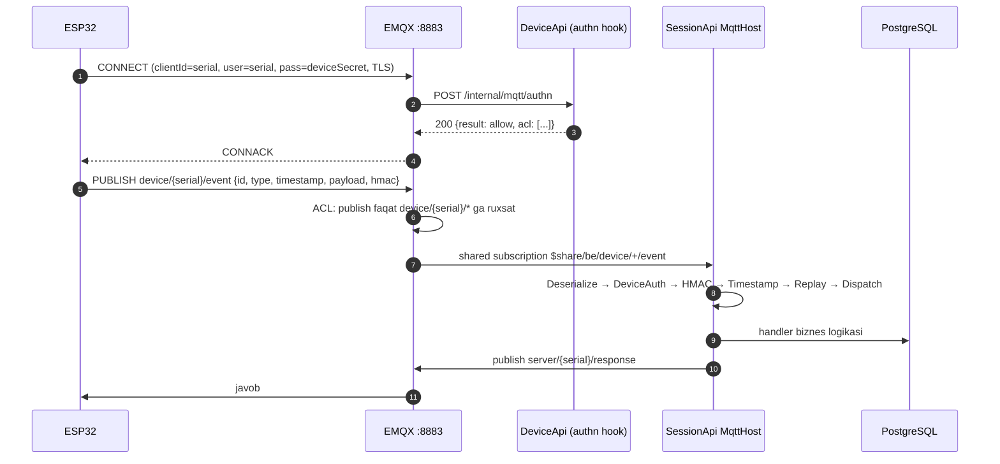

---

## 4. API Gateway — YARP

### 4.1 Nima uchun YARP + Nginx (ikkalasi ham)

| Vazifa | Kim bajaradi | Nega |
|---|---|---|
| TLS termination, sertifikat auto-renew | **Nginx** | certbot bilan nol-kod integratsiya; YARP qayta ishga tushganda ham 443 tirik qoladi |
| HTTP/2, HTTP/3, gzip/brotli, statik fayllar | **Nginx** | Yillar davomida sinovdan o'tgan; .NET'da bularni qayta yozish shart emas |
| Connection-level DDoS, slowloris, conn limit | **Nginx** | `limit_conn`, `client_body_timeout` — L4/L7 chegarasida arzon |
| `/mqtt` WSS → EMQX | **Nginx** | Uzoq yashovchi WS ulanishlarni gateway'dan uzoq tutadi; JWT kerak emas |
| Route → servis, path transform | **YARP** | Konfiguratsiya .NET'da, kod bilan bir joyda, hot-reload |
| JWT tekshiruv, audience, claim'lardan header | **YARP** | Bir marta, chekkada; noto'g'ri token servislargacha yetmaydi |
| Rate limit (per-user, per-endpoint) | **YARP** | `HttpContext.User` mavjud → user bo'yicha partition qilish mumkin |
| Audit log, request/response log, correlation ID | **YARP** | Strukturali, biznes kontekst bilan (userId, merchantId) |
| Swagger aggregation | **YARP** | 7 ta definition bitta UI'da |
| Active health check, load balancing, retry | **YARP** | Servis holatini biladi, o'lgan replikaga yubormaydi |

> **Alternativa:** Nginx'siz, YARP o'zi 443'da TLS terminate qilishi mumkin (Kestrel + `LettuceEncrypt`). Kamroq hop, kamroq konfiguratsiya. **Nega tavsiya qilmayapman:** har deploy'da YARP restart bo'ladi → 443 bir necha soniya o'lik; certbot renewal .NET jarayoniga bog'lanadi; `/mqtt` WSS ni ham YARP ko'taradi va uzoq WS ulanishlar gateway restart'ida uziladi. Agar jamoa Nginx'ni saqlashni istamasa — bu variant ham to'g'ri, lekin YARP kamida 2 replikada ishlashi kerak.

### 4.2 URL sxemasi va path transform

Public URL — **`/api/{servis}/{controller}/{action}`**. Gateway `{servis}` segmentini olib tashlaydi:

```
https://company.uz/api/auth/Auth/Login          → AuthApi      /api/Auth/Login
https://company.uz/api/auth/PlatformAuth/Login  → AuthApi      /api/PlatformAuth/Login
https://company.uz/api/user/User/Profile        → UserApi      /api/User/Profile
https://company.uz/api/admin/Station/GetAll     → AdminApi     /api/Station/GetAll
https://company.uz/api/session/Session/Create   → SessionApi   /api/Session/Create
https://company.uz/api/billing/Balance/TopUp    → BillingApi   /api/Balance/TopUp
https://company.uz/api/payment/Payme/Callback   → PaymentApi   /api/Payme/Callback
https://company.uz/hubs/session                 → SessionApi   /hubs/session
```

**Nega birinchi segment bo'yicha emas, servis prefiksi bilan?** Controller nomlari servislar orasida takrorlanadi — `DeviceController` AdminApi'da ham, DeviceApi'da ham bor; `PaymentController` PaymentApi'da ham, SessionApi'da ham bor; `UserController` AdminApi va UserApi'da. `/api/Device/...` ni qaysi servisga yuborishni gateway aniqlay olmaydi. Servis prefiksi bu noaniqlikni butunlay yo'q qiladi va yangi servis qo'shilganda hech narsa buzilmaydi.

`auth/Auth` takrori faqat controller nomi servis nomiga teng bo'lgan 3 joyda (`auth`, `user`, `payment`) ko'rinadi. Ikki yechim bor:
- **Tavsiya (0 breaking change):** shundayligicha qoldiring. Mobil ilova base URL'ni bir marta yozadi.
- **Kosmetik:** eng ko'p ishlatiladigan endpointlar uchun gateway'da "vanity route" qo'shing (`/api/auth/login` → `/api/Auth/Login`) va eski catch-all'ni ham qoldiring.

### 4.3 Gateway loyihasi — `WebApi/Gateway/Program.cs`

```csharp
using CommonConfiguration.ConfigurationExtensions;
using CommonConfiguration.ConfigurationServices;
using Gateway.Middlewares;
using Microsoft.AspNetCore.HttpOverrides;
using Yarp.ReverseProxy.Transforms;

var builder = WebApplication.CreateBuilder(args);
builder.AddBotEnergyLogging("Gateway");
builder.Configuration.AddCommonConfiguration();

// --- Reverse proxy ---
builder.Services
    .AddReverseProxy()
    .LoadFromConfig(builder.Configuration.GetSection("ReverseProxy"))
    .AddTransforms(ctx =>
    {
        // Har bir so'rovga correlation ID — log/trace bo'ylab bir xil qiymat
        ctx.AddRequestTransform(t =>
        {
            var requestId = t.HttpContext.TraceIdentifier;
            t.ProxyRequest.Headers.TryAddWithoutValidation("X-Request-Id", requestId);

            // Downstream servislar uchun identity konteksti (audit uchun, ishonch uchun EMAS —
            // servis baribir JWT'ni o'zi tekshiradi)
            var user = t.HttpContext.User;
            if (user?.Identity?.IsAuthenticated == true)
            {
                void Fwd(string claim, string header)
                {
                    var v = user.FindFirst(claim)?.Value;
                    if (!string.IsNullOrEmpty(v))
                        t.ProxyRequest.Headers.TryAddWithoutValidation(header, v);
                }
                Fwd("sub", "X-User-Id");
                Fwd("UserGroup", "X-User-Group");
                Fwd("MerchantId", "X-Merchant-Id");
                Fwd("OrganizationId", "X-Organization-Id");
            }
            return ValueTask.CompletedTask;
        });
    });

// --- Auth: ikkala audience ham (Customer + Platform) chekkada qabul qilinadi,
//     qaysi API qaysisini qabul qilishini servisning o'zi hal qiladi ---
builder.Services.AddJwtAuthentication(builder.Configuration, signalRHubPath: "/hubs");
builder.Services.AddAuthorization(o =>
{
    o.AddPolicy("authenticated", p => p.RequireAuthenticatedUser());
});

builder.Services.AddGatewayRateLimiting(builder.Configuration); // §4.5
builder.Services.AddSimulatorCors(builder.Configuration);       // mavjud extension qayta ishlatiladi
builder.Services.AddHealthChecks();
builder.Services.AddGatewaySwagger(builder.Configuration);      // §4.6

builder.Services.Configure<ForwardedHeadersOptions>(o =>
{
    o.ForwardedHeaders = ForwardedHeaders.XForwardedFor | ForwardedHeaders.XForwardedProto;
    o.KnownNetworks.Clear();                       // Nginx docker tarmog'ida
    o.KnownProxies.Clear();
});

var app = builder.Build();

app.UseForwardedHeaders();          // RemoteIpAddress = haqiqiy klient IP (rate limit uchun shart)
app.UseMiddleware<AuditLoggingMiddleware>();   // §4.4
app.UseSimulatorCors();
app.UseRateLimiter();
app.UseAuthentication();
app.UseAuthorization();

app.MapHealthChecks("/health/live");
app.MapGatewaySwaggerUi();
app.MapReverseProxy();

app.Run();
```

> `UseForwardedHeaders()` **bo'lmasa** rate limiting butunlay buziladi — barcha so'rovlar Nginx'ning bitta IP'sidan kelgandek ko'rinadi va bitta foydalanuvchi hammani bloklaydi. Bu eng ko'p uchraydigan xato.

### 4.4 Audit va request/response logging

Ikki xil log — aralashtirmaslik kerak:

| | Request log | Audit log |
|---|---|---|
| Nima | Har bir HTTP so'rov: metod, path, status, davomiylik | Biznes ahamiyatga ega harakat: kim, nima, qachon, qaysi obyektga |
| Hajm | Juda katta | Kichik |
| Saqlash | Loki, 14–30 kun | PostgreSQL `audit.audit_log` jadvali, 1–3 yil |
| Kim yozadi | Serilog `UseSerilogRequestLogging` | Gateway middleware + servislar |

```csharp
public sealed class AuditLoggingMiddleware
{
    private static readonly string[] AuditedMethods = { "POST", "PUT", "PATCH", "DELETE" };
    private readonly RequestDelegate _next;
    private readonly ILogger<AuditLoggingMiddleware> _log;

    public AuditLoggingMiddleware(RequestDelegate next, ILogger<AuditLoggingMiddleware> log)
        => (_next, _log) = (next, log);

    public async Task InvokeAsync(HttpContext ctx)
    {
        var sw = System.Diagnostics.Stopwatch.StartNew();
        await _next(ctx);
        sw.Stop();

        if (!AuditedMethods.Contains(ctx.Request.Method)) return;

        _log.LogInformation(
            "AUDIT {Method} {Path} status={Status} user={UserId} group={Group} ip={Ip} ms={Elapsed} reqId={ReqId}",
            ctx.Request.Method,
            ctx.Request.Path.Value,
            ctx.Response.StatusCode,
            ctx.User.FindFirst("sub")?.Value ?? "anonymous",
            ctx.User.FindFirst("UserGroup")?.Value ?? "-",
            ctx.Connection.RemoteIpAddress?.ToString(),
            sw.ElapsedMilliseconds,
            ctx.TraceIdentifier);
    }
}
```

**Body loglash bo'yicha qoida:** request/response body'ni **default'da yozmang**. Sabab: `Auth/Login` paroli, `Payme` kartasi, PDP (shaxsiy ma'lumot) log'ga tushadi va GDPR/O'zbekiston PD qonuni bo'yicha muammo. Kerak bo'lsa — faqat aniq route'lar uchun, maskalash bilan (`password`, `card`, `secret`, `token`, `hmac` maydonlari `***`).

### 4.5 Rate limiting

Hozir `AddIpRateLimiting` faqat AuthApi'da va faqat IP bo'yicha (30/min). Gateway'da uch qatlamli:

```csharp
public static IServiceCollection AddGatewayRateLimiting(this IServiceCollection services, IConfiguration config)
{
    services.AddRateLimiter(options =>
    {
        options.RejectionStatusCode = StatusCodes.Status429TooManyRequests;
        options.OnRejected = (ctx, _) =>
        {
            ctx.HttpContext.Response.Headers.RetryAfter = "60";
            return ValueTask.CompletedTask;
        };

        // 1) Global himoya to'ri — IP bo'yicha, barcha route'lar
        options.GlobalLimiter = PartitionedRateLimiter.Create<HttpContext, string>(ctx =>
            RateLimitPartition.GetFixedWindowLimiter(
                ctx.Connection.RemoteIpAddress?.ToString() ?? "unknown",
                _ => new FixedWindowRateLimiterOptions
                {
                    PermitLimit = config.GetValue("RateLimit:GlobalPerMinute", 300),
                    Window = TimeSpan.FromMinutes(1),
                    QueueLimit = 0
                }));

        // 2) Auth endpointlari — brute-force'ga qarshi qattiq
        options.AddPolicy("auth-strict", ctx =>
            RateLimitPartition.GetFixedWindowLimiter(
                ctx.Connection.RemoteIpAddress?.ToString() ?? "unknown",
                _ => new FixedWindowRateLimiterOptions
                {
                    PermitLimit = config.GetValue("RateLimit:AuthPerMinute", 10),
                    Window = TimeSpan.FromMinutes(1),
                    QueueLimit = 0
                }));

        // 3) Autentifikatsiyalangan foydalanuvchi bo'yicha — bitta akkaunt API'ni yeb qo'ymasin
        options.AddPolicy("per-user", ctx =>
        {
            var userId = ctx.User.FindFirst("sub")?.Value;
            return userId is null
                ? RateLimitPartition.GetFixedWindowLimiter(
                    ctx.Connection.RemoteIpAddress?.ToString() ?? "unknown",
                    _ => new FixedWindowRateLimiterOptions { PermitLimit = 60, Window = TimeSpan.FromMinutes(1) })
                : RateLimitPartition.GetTokenBucketLimiter(userId, _ => new TokenBucketRateLimiterOptions
                {
                    TokenLimit = 120,               // burst
                    TokensPerPeriod = 60,           // barqaror tezlik
                    ReplenishmentPeriod = TimeSpan.FromMinutes(1),
                    QueueLimit = 0,
                    AutoReplenishment = true
                });
        });
    });
    return services;
}
```

**Eslatma:** `PartitionedRateLimiter` — **in-memory**. Gateway 2+ replikaga chiqqanda limit replika soniga ko'payadi. Bu bosqichda tolerant; qat'iy limit kerak bo'lsa Redis-backed limiter (masalan, `RedisRateLimiting` paketi) ga o'ting yoki Nginx `limit_req` ni birinchi qator qiling.

### 4.6 Swagger aggregation

```csharp
// Gateway 7 ta downstream swagger.json ni bitta UI'da ko'rsatadi
public static IApplicationBuilder MapGatewaySwaggerUi(this WebApplication app)
{
    if (!app.Configuration.GetValue("Swagger:Enabled", false)) return app;

    app.UseSwaggerUI(c =>
    {
        c.SwaggerEndpoint("/api/auth/swagger/v1/swagger.json",    "Auth API");
        c.SwaggerEndpoint("/api/user/swagger/v1/swagger.json",    "User API");
        c.SwaggerEndpoint("/api/admin/swagger/v1/swagger.json",   "Admin API");
        c.SwaggerEndpoint("/api/session/swagger/v1/swagger.json", "Session API");
        c.SwaggerEndpoint("/api/billing/swagger/v1/swagger.json", "Billing API");
        c.SwaggerEndpoint("/api/payment/swagger/v1/swagger.json", "Payment API");
        c.SwaggerEndpoint("/api/device/swagger/v1/swagger.json",  "Device API");
        c.RoutePrefix = "swagger";
    });
    return app;
}
```

Downstream tomonda `servers` URL'i gateway prefiksini bilishi kerak, aks holda "Try it out" 404 beradi:

```csharp
// CommonConfiguration/AddSwaggerWithJwtAuth ichiga qo'shiladi
app.UseSwagger(o => o.PreSerializeFilters.Add((doc, req) =>
{
    var prefix = req.Headers["X-Forwarded-Prefix"].FirstOrDefault(); // YARP transform yuboradi
    if (!string.IsNullOrEmpty(prefix))
        doc.Servers = new List<OpenApiServer> { new() { Url = prefix } };
}));
```

**Production'da Swagger:** `Swagger:Enabled` production'da `false`, yoki `/swagger` ni Nginx'da IP allowlist / basic auth ortiga qo'ying. Hozir barcha 7 API `app.UseSwagger()` ni shartsiz chaqiradi — bu API yuzasini butunlay oshkor qiladi.

### 4.7 `Configuration.json` — ReverseProxy bo'limi

```jsonc
{
  "ReverseProxy": {
    "Routes": {
      // --- Auth: qattiq rate limit, anonim ruxsat ---
      "auth": {
        "ClusterId": "auth",
        "Match": { "Path": "/api/auth/{**catch-all}" },
        "RateLimiterPolicy": "auth-strict",
        "Transforms": [
          { "PathRemovePrefix": "/api/auth" },
          { "PathPrefix": "/api" },
          { "RequestHeader": "X-Forwarded-Prefix", "Set": "/api/auth" }
        ]
      },
      "user": {
        "ClusterId": "user",
        "Match": { "Path": "/api/user/{**catch-all}" },
        "AuthorizationPolicy": "authenticated",
        "RateLimiterPolicy": "per-user",
        "Transforms": [
          { "PathRemovePrefix": "/api/user" },
          { "PathPrefix": "/api" },
          { "RequestHeader": "X-Forwarded-Prefix", "Set": "/api/user" }
        ]
      },
      "admin": {
        "ClusterId": "admin",
        "Match": { "Path": "/api/admin/{**catch-all}" },
        "AuthorizationPolicy": "authenticated",
        "RateLimiterPolicy": "per-user",
        "Transforms": [
          { "PathRemovePrefix": "/api/admin" },
          { "PathPrefix": "/api" },
          { "RequestHeader": "X-Forwarded-Prefix", "Set": "/api/admin" }
        ]
      },
      "session": {
        "ClusterId": "session",
        "Match": { "Path": "/api/session/{**catch-all}" },
        "AuthorizationPolicy": "authenticated",
        "RateLimiterPolicy": "per-user",
        "Transforms": [
          { "PathRemovePrefix": "/api/session" },
          { "PathPrefix": "/api" },
          { "RequestHeader": "X-Forwarded-Prefix", "Set": "/api/session" }
        ]
      },
      "billing":  { "ClusterId": "billing",  "Match": { "Path": "/api/billing/{**catch-all}" },  "AuthorizationPolicy": "authenticated", "RateLimiterPolicy": "per-user",
        "Transforms": [ { "PathRemovePrefix": "/api/billing" }, { "PathPrefix": "/api" }, { "RequestHeader": "X-Forwarded-Prefix", "Set": "/api/billing" } ] },

      // Payme callback — JWT emas, Payme imzosi bilan; shuning uchun policy yo'q
      "payment":  { "ClusterId": "payment",  "Match": { "Path": "/api/payment/{**catch-all}" },
        "Transforms": [ { "PathRemovePrefix": "/api/payment" }, { "PathPrefix": "/api" }, { "RequestHeader": "X-Forwarded-Prefix", "Set": "/api/payment" } ] },

      "device":   { "ClusterId": "device",   "Match": { "Path": "/api/device/{**catch-all}" },   "AuthorizationPolicy": "authenticated",
        "Transforms": [ { "PathRemovePrefix": "/api/device" }, { "PathPrefix": "/api" }, { "RequestHeader": "X-Forwarded-Prefix", "Set": "/api/device" } ] },

      // --- SignalR: transform yo'q, path o'zgarmaydi ---
      "hubs": {
        "ClusterId": "session",
        "Match": { "Path": "/hubs/{**catch-all}" }
      }
    },

    "Clusters": {
      "auth": {
        "LoadBalancingPolicy": "PowerOfTwoChoices",
        "HealthCheck": {
          "Active": { "Enabled": true, "Interval": "00:00:10", "Timeout": "00:00:05",
                      "Policy": "ConsecutiveFailures", "Path": "/health/ready" },
          "Passive": { "Enabled": true, "Policy": "TransportFailureRate", "ReactivationPeriod": "00:00:30" }
        },
        "Destinations": {
          "auth-1": { "Address": "http://authapi:5002/" }
        }
      },
      "user":    { "Destinations": { "user-1":    { "Address": "http://userapi:5006/" } } },
      "admin":   { "Destinations": { "admin-1":   { "Address": "http://adminapi:5001/" } } },
      "billing": { "Destinations": { "billing-1": { "Address": "http://billingapi:5003/" } } },
      "payment": { "Destinations": { "payment-1": { "Address": "http://paymentapi:5005/" } } },
      "device":  { "Destinations": { "device-1":  { "Address": "http://deviceapi:5004/" } } },

      // --- SessionApi: SignalR uchun maxsus sozlamalar ---
      "session": {
        "LoadBalancingPolicy": "PowerOfTwoChoices",
        "SessionAffinity": {
          "Enabled": true,
          "Policy": "Cookie",
          "AffinityKeyName": ".BotEnergy.Affinity",
          "FailurePolicy": "Redistribute",
          "Cookie": { "SameSite": "None", "SecurePolicy": "Always", "HttpOnly": true }
        },
        "HttpRequest": {
          "ActivityTimeout": "00:05:00",
          "Version": "1.1",
          "VersionPolicy": "RequestVersionOrLower"
        },
        "HealthCheck": {
          "Active": { "Enabled": true, "Interval": "00:00:10", "Timeout": "00:00:05",
                      "Policy": "ConsecutiveFailures", "Path": "/health/ready" }
        },
        "Destinations": {
          "session-1": { "Address": "http://sessionapi:5007/" }
        }
      }
    }
  }
}
```

Har bir cluster'da `HealthCheck` bo'limi bir xil — yuqorida faqat `auth` va `session` uchun to'liq yozildi, qolganlariga ham xuddi shu blok qo'shiladi.

---

## 5. SignalR YARP ortida

### 5.1 Nima ishlashi kerak

`wss://company.uz/hubs/session` — mobil ilova bitta domendan, bitta portdan ulanadi. Uch to'siq bor: WebSocket upgrade, JWT uzatish, va ko'p instansiya.

### 5.2 WebSocket upgrade

YARP WebSocket'ni **avtomatik** proxy qiladi — alohida `UseWebSockets()` kerak emas, `MapReverseProxy()` upgrade so'rovini o'zi tanib oladi. Uch shart:

1. **Nginx `Upgrade`/`Connection` header'ini uzatishi kerak** (§9.2 konfiguratsiyada bor).
2. **`HttpRequest.Version = "1.1"`** cluster'da — WebSocket HTTP/2 bo'ylab faqat Extended CONNECT bilan ishlaydi; HTTP/1.1'ga tushirish eng ishonchli yo'l. SessionApi Kestrel'i allaqachon `Http1AndHttp2` da (`SessionApi/Program.cs:23`) — mos keladi.
3. **`ActivityTimeout`** default 100 soniya — jim turgan hub ulanishi uziladi. `00:05:00` qo'yiladi va SignalR `KeepAliveInterval` (default 15s) undan kichik bo'lgani uchun ping ulanishni tirik saqlaydi.

### 5.3 JWT

Brauzer WebSocket API'sida `Authorization` header'ini o'rnatib bo'lmaydi — shuning uchun SignalR tokenni `?access_token=` da yuboradi. Kodda bu allaqachon hal qilingan (`ConfigurationAddExtensions.cs:168-181` — `OnMessageReceived` `/hubs` path uchun query'dan oladi). Gateway ham xuddi shu extension'ni `signalRHubPath: "/hubs"` bilan chaqiradi, ya'ni token chekkada ham tekshiriladi.

> **Xavfsizlik eslatmasi:** query-string'dagi token Nginx `access_log` ga tushadi. Nginx'da `/hubs` uchun `access_log off;` yoki `$request_uri` ni maskalaydigan log format ishlating.

### 5.4 Ko'p instansiya — Redis backplane

Bitta SessionApi replikasi bo'lsa muammo yo'q. Ikkinchisi qo'shilishi bilan: telemetriya MQTT orqali **1-instansiyaga** keladi, lekin mobil ilova **2-instansiyaga** ulangan bo'lishi mumkin → xabar yetib bormaydi.

```csharp
// SessionApi/Program.cs
builder.Services.AddSignalR()
    .AddStackExchangeRedis(builder.Configuration["Redis:ConnectionString"]!, o =>
    {
        o.Configuration.ChannelPrefix = StackExchange.Redis.RedisChannel.Literal("botenergy-signalr");
        o.Configuration.AbortOnConnectFail = false;
    });
```

NuGet: `Microsoft.AspNetCore.SignalR.StackExchangeRedis`.

**Session affinity nega baribir kerak?** Redis backplane xabar tarqatishni hal qiladi, lekin WebSocket ishlamagan tarmoqda SignalR **long polling**'ga tushadi — u holda har bir poll so'rovi bir xil instansiyaga borishi shart. YARP `SessionAffinity` (cookie) shuni ta'minlaydi. Ikkalasi ham yoqiladi.

### 5.5 SignalR oqimi — ko'p instansiya

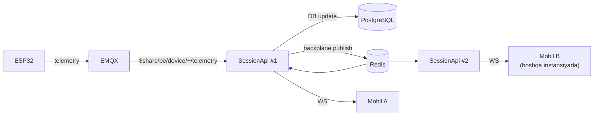

### 5.6 Guruh sxemasi (mavjud kodda)

| Guruh | Kim qo'shiladi | Nima uchun |
|---|---|---|
| `sessionToken` | Bitta sessiyani kuzatayotgan planshet + telefon | Sessiya ichidagi hodisalar |
| `user:{userId}` | `SessionHub.OnConnectedAsync` da JWT'dan avtomatik | Sessiya tokenisiz cross-device push |

Bu sxema o'zgarishsiz qoladi — backplane uni shaffof qiladi.

---

## 6. MQTT arxitekturasi

### 6.1 Broker tanlovi — EMQX

| Broker | Klaster | WSS | Per-client ACL | HTTP auth hook | Observability | Xulosa |
|---|---|---|---|---|---|---|
| **EMQX 5.x (OSS)** | ✅ native, Erlang cluster | ✅ | ✅ granular | ✅ | ✅ Prometheus + dashboard | **Tavsiya** |
| Mosquitto | ❌ (bridge bilan qo'lda) | ✅ | ⚠️ fayl-asosli, statik | ⚠️ faqat plugin yozish | ❌ minimal | Kichik prototip uchun |
| VerneMQ | ✅ | ✅ | ✅ | ✅ | ✅ | Yaxshi alternativa, jamoasi kichikroq |
| HiveMQ CE | ⚠️ (CE'da klaster yo'q) | ✅ | plugin | plugin | ✅ | Enterprise'da kuchli, OSS cheklangan |
| NanoMQ | ❌ | ✅ | ⚠️ | ⚠️ | ⚠️ | Edge/embedded uchun |

**Nega EMQX:**
- **Bitta broker, hamma transport.** TCP/1883, TLS/8883, WS/8083, WSS — bularning hammasi bitta topic space. Talab "bir klient publish qilsa, hamma subscriber ko'rsin" avtomatik bajariladi, chunki bu **bitta** broker jarayonining ichki holati. Transport faqat ulanish usuli, xabar yo'nalishiga ta'sir qilmaydi.
- **HTTP authn/authz hook** — device credential'ini o'z DB'ingizdan tekshirasiz, brokerga foydalanuvchi ro'yxatini ko'chirmaysiz.
- **Shared subscription** (`$share/...`) — SessionApi'ni horizontal masshtablashning yagona to'g'ri yo'li (§6.6).
- **MQTT 5.0** — response topic, correlation data, user properties. Kelajakda envelope'ning bir qismini protokol darajasiga ko'chirish imkoni.
- Bitta node'da 100k+ ulanish, 100k+ msg/s — sizning 3–10k qurilmangiz uchun zaxira juda katta.

### 6.2 Listener konfiguratsiyasi — `deploy/emqx/emqx.conf`

```hocon
node {
  name = "emqx@127.0.0.1"
  cookie = "${EMQX_NODE_COOKIE}"
  data_dir = "/opt/emqx/data"
}

listeners.ssl.default {
  bind = "0.0.0.0:8883"
  max_connections = 50000
  ssl_options {
    certfile   = "/etc/emqx/certs/fullchain.pem"
    keyfile    = "/etc/emqx/certs/privkey.pem"
    versions   = ["tlsv1.3", "tlsv1.2"]
    verify     = verify_none          # mTLS bosqichida → verify_peer (§10.5)
    fail_if_no_peer_cert = false
  }
}

# WebSocket — Nginx ortida, TLS'ni Nginx terminate qiladi
listeners.ws.default {
  bind = "0.0.0.0:8083"
  max_connections = 20000
  websocket {
    mqtt_path = "/mqtt"
    proxy_address_header = "x-forwarded-for"
    proxy_port_header = "x-forwarded-port"
  }
}

# Plain TCP — production'da O'CHIRILADI
listeners.tcp.default { enable = false }

# Backend servis va qurilmalar uchun umumiy limitlar
mqtt {
  max_packet_size = 64KB
  keepalive_multiplier = 1.5
  max_qos_allowed = 1
  retain_available = true
  session_expiry_interval = 2h
}

authentication = [
  {
    mechanism = password_based
    backend = http
    method = post
    url = "http://deviceapi:5004/internal/mqtt/authn"
    headers { "content-type" = "application/json", "x-internal-secret" = "${INTERNAL_API_SECRET}" }
    body {
      clientid = "${clientid}"
      username = "${username}"
      password = "${password}"
    }
    pool_size = 8
    request_timeout = "5s"
  }
]

authorization {
  no_match = deny
  deny_action = disconnect
  cache { enable = true, max_size = 32000, ttl = "5m" }
  sources = [
    {
      type = http
      method = post
      url = "http://deviceapi:5004/internal/mqtt/authz"
      headers { "content-type" = "application/json", "x-internal-secret" = "${INTERNAL_API_SECRET}" }
      body { clientid = "${clientid}", username = "${username}", topic = "${topic}", action = "${action}" }
    }
  ]
}

prometheus { enable = true, push_gateway_server = "" }
```

### 6.3 Topic sxemasi (mavjud kodda — o'zgarishsiz)

| Topic | Yo'nalish | QoS | Izoh |
|---|---|---|---|
| `device/{serial}/request` | device → server | 1 | Javob talab qiladi |
| `device/{serial}/response` | device → server | 1 | Server so'roviga javob |
| `device/{serial}/event` | device → server | 1 | Fire-and-forget |
| `device/{serial}/telemetry` | device → server | 0 | Yuqori chastota, yo'qotish tolerant |
| `device/{serial}/state` | device → server | 1, retained | Holat snapshot'i |
| `server/{serial}/request` | server → device | 1 | Buyruq |
| `server/{serial}/response` | server → device | 1 | Device so'roviga javob |

Manba: `WebApi/SessionApi/Mqtt/Topics/MqttTopics.cs`.

### 6.4 Autentifikatsiya va ACL — hozirgi holatdan farq

**Hozir:** barcha qurilmalar bitta `botenergy-device` / `BE_Mq_2026_pr0d_x9K4nP7vW2` juftligi bilan ulanadi. Bitta ESP32'ni fizik ochib flash'ni o'qigan odam istalgan qurilma nomidan publish qila oladi. HMAC ikkinchi qatlam bo'lib qoladi, lekin broker darajasida hech qanday izolyatsiya yo'q.

**Bo'lishi kerak:** har bir qurilma o'z credential'i bilan, faqat o'z topic'lariga ruxsat.

```csharp
// WebApi/DeviceApi/Controllers/InternalMqttController.cs
[ApiController]
[Route("internal/mqtt")]
[SkipPermissionCheck]                      // JWT emas — internal shared secret bilan himoyalangan
[ServiceFilter(typeof(InternalSecretFilter))]
public sealed class InternalMqttController : ControllerBase
{
    private readonly IDeviceRepository _devices;

    [HttpPost("authn")]
    public async Task<IActionResult> Authn([FromBody] MqttAuthnRequest req)
    {
        // Backend servislari uchun alohida hisob
        if (req.Username == "botenergy-backend")
            return Ok(new { result = ServiceSecretMatches(req.Password) ? "allow" : "deny" });

        var device = await _devices.GetBySerialNumberAsync(req.Username);
        if (device is null || device.IsBlocked)
            return Ok(new { result = "deny" });

        // clientId = serial bo'lishi shart — boshqa qurilma nomidan ulanishning oldini oladi
        if (!string.Equals(req.ClientId, req.Username, StringComparison.Ordinal))
            return Ok(new { result = "deny" });

        // MQTT paroli = device.MqttPassword (PBKDF2 hash bilan solishtiriladi),
        // SecretKey esa HMAC uchun — ikkalasi ALOHIDA sir bo'lsin
        var ok = PasswordHelper.Verify(req.Password, device.MqttPasswordHash);
        return Ok(new { result = ok ? "allow" : "deny", is_superuser = false });
    }

    [HttpPost("authz")]
    public IActionResult Authz([FromBody] MqttAuthzRequest req)
    {
        if (req.Username == "botenergy-backend")
            return Ok(new { result = "allow" });

        var serial = req.Username;
        var allowed = req.Action switch
        {
            "publish"   => req.Topic.StartsWith($"device/{serial}/", StringComparison.Ordinal),
            "subscribe" => req.Topic.StartsWith($"server/{serial}/", StringComparison.Ordinal),
            _ => false
        };
        return Ok(new { result = allowed ? "allow" : "deny" });
    }
}
```

> **Implementatsiyada tanlangan yo'l — `MqttPasswordHash` ustunisiz.** Yuqoridagi kod
> yangi DB ustunini nazarda tutadi. Amalda parol `SecretKey` dan **bir tomonlama hosil
> qilinadi**: `HMAC-SHA256(SecretKey, "botenergy-mqtt-auth-v1")`
> (`Domain/Helpers/DeviceMqttCredentials`). Natija bir xil: broker faqat derivatsiya
> qiymatini ko'radi va undan `SecretKey` ni tiklab bo'lmaydi, ya'ni HMAC qatlami mustaqil
> himoya bo'lib qoladi — lekin sxema o'zgarmaydi va migratsiya kerak bo'lmaydi.

**Migratsiya rejasi (qurilmalarni sindirmasdan):**
1. EMQX authn hook yoqiladi (`InternalMqttController`).
2. Har bir qurilmaning credential'i `GET /api/admin/Device/MqttCredentials/{id}` orqali olinadi.
3. Firmware partiya-partiya yangilanadi: `username`=`clientId`=serial, parol — derivatsiya qiymati.
4. `botenergy_mqtt_rejected_total` va EMQX klient ro'yxati kuzatiladi; eski credential'ga tayangan qurilma qolmaganda o'tish yakunlanadi.

### 6.5 To'liq MQTT kommunikatsiya oqimi

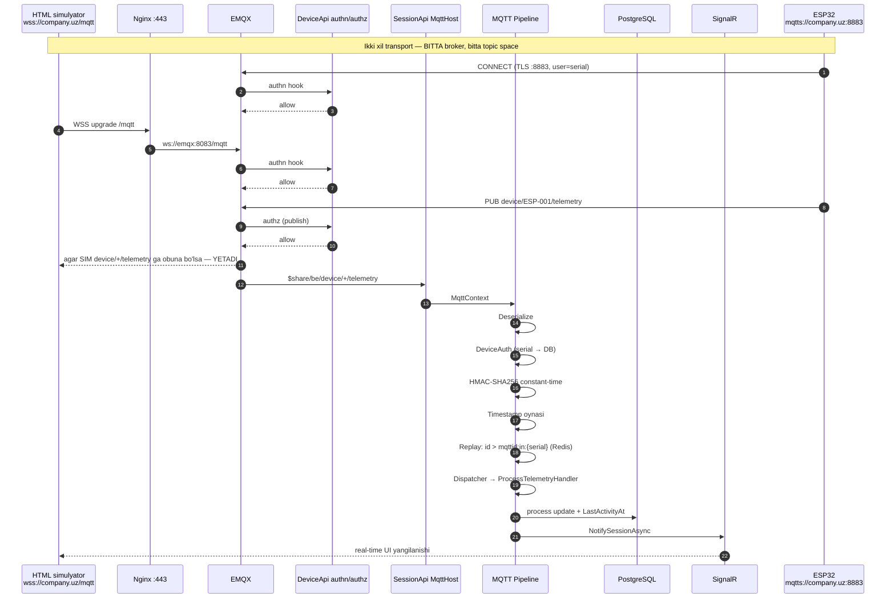

**"Hech bir klient transport tufayli boshqacha ishlamasin" talabi qanday bajariladi:** EMQX'da routing table transportdan mustaqil. `device/ESP-001/telemetry` ga obuna bo'lgan WSS klient ham, TCP klient ham, backend ham bir xil nusxani oladi. Yagona shart — **hammasi bir xil broker instansiyasiga** ulansin, ya'ni alohida "test broker" yoki alohida Mosquitto ishlatilmasin.

> **Diqqat — simulyator uchun ACL:** yuqoridagi ACL qoidasi qat'iy bo'lgani uchun HTML simulyator `device/+/telemetry` ga obuna bo'la olmaydi. Simulyator uchun alohida hisob kerak: `botenergy-simulator` — `device/#` ga read-only subscribe, publish faqat o'zi taqlid qilayotgan serial'ga. Bu hisob **faqat non-prod muhitda** yoqiladi.

### 6.6 MQTT + horizontal masshtab — hozirgi kodda blocker bor

`MqttConnection.ConnectAsync` `ClientId`ni konfiguratsiyadan oladi (`botenergy-device-api`) va `WithCleanSession(false)` ishlatadi (`MqttConnection.cs:44-45`). MQTT spetsifikatsiyasi bo'yicha **bir xil ClientId bilan ikkinchi ulanish birinchisini uzadi**. Ya'ni SessionApi'ni 2 replikaga chiqarsangiz, ikkala instansiya bir-birini cheksiz uzib turadi.

Ikki o'zgarish kerak:

```csharp
// 1) ClientId har instansiyada unikal
var clientId = $"{_options.ClientId}-{Environment.MachineName}-{Environment.ProcessId}";

// 2) Subscribe — shared subscription orqali, yuk replikalar orasida taqsimlanadi
await _connection.SubscribeAsync("$share/botenergy/device/+/telemetry", MqttQualityOfServiceLevel.AtMostOnce, ct);
await _connection.SubscribeAsync("$share/botenergy/device/+/event",     MqttQualityOfServiceLevel.AtLeastOnce, ct);
await _connection.SubscribeAsync("$share/botenergy/device/+/request",   MqttQualityOfServiceLevel.AtLeastOnce, ct);
await _connection.SubscribeAsync("$share/botenergy/device/+/response",  MqttQualityOfServiceLevel.AtLeastOnce, ct);
// state — retained snapshot, HAR BIR instansiyaga kerak → shared EMAS
await _connection.SubscribeAsync("device/+/state", MqttQualityOfServiceLevel.AtLeastOnce, ct);
```

**Replay counter'lariga ta'siri:** counter'lar Redis'da (`mqttid:in:{serial}`) — instansiyalar orasida umumiy, shuning uchun shared subscription bilan ham to'g'ri ishlaydi. Bitta qurilmaning ikki xabari **parallel** ikki instansiyada ishlanganda ham race yo'q: `RedisMqttMessageIdStore` allaqachon **Lua script bilan atomik compare-and-set** qiladi (`if id > current then set; return 1 else return 0`). Bu yerda o'zgartirish kerak emas.

**MQTT counter'lar hech qachon avtomatik reset qilinmaydi** — bu loyihaning qat'iy qoidasi (faqat `POST /api/Device/ResetMqttCounters/{id}`, Manage-only). Klaster/restart bu qoidaga ta'sir qilmaydi, chunki holat Redis'da TTL'siz.

---

## 7. RabbitMQ — servislararo asinxron aloqa

### 7.1 Ochiq gap: RabbitMQ bu loyihadan ataylab olib tashlangan

`CLAUDE.md` aniq yozadi: *"RabbitMQ removed — device messaging is MQTT-only"*. Buyruqlar endi to'g'ridan-to'g'ri MQTT'ga chiqadi (`MqttDeviceCommandPublisher`), oraliq hop yo'q. **Bu to'g'ri qaror edi** — qurilmaga buyruq yuborish uchun RabbitMQ → MQTT bridge ortiqcha kechikish va ortiqcha ishlamay qolish nuqtasi edi.

Shuning uchun bu bo'lim RabbitMQ'ni **qaytarish** haqida emas, balki **boshqa vazifa uchun kiritish** haqida. Ikkalasining rolini aralashtirmaslik kerak:

| | MQTT (EMQX) | RabbitMQ |
|---|---|---|
| Rol | **North-south** — server ↔ qurilma | **East-west** — servis ↔ servis |
| Klient | ESP32, simulyator, mobil | Faqat backend servislar |
| Model | pub/sub, topic | work queue + topic exchange |
| Yetkazish | QoS 0/1, retained | Persistent, ack, DLQ, retry |
| Public | Ha (8883, wss) | **Hech qachon** |

### 7.2 Qachon kiritish kerak — va qachon kerak emas

RabbitMQ'ni **hozir** kiritish uchun asos yo'q. Uni quyidagi ehtiyojlardan **birinchisi** paydo bo'lganda kiriting:

| Trigger | Nega RabbitMQ |
|---|---|
| Push/SMS/email yuborish sessiya yopilganda | HTTP so'rovni sekinlashtirmasligi, tashqi provayder yiqilsa retry |
| Payme capture/refund natijasini bir necha servis eshitishi | Fan-out, bitta hodisa → N ta iste'molchi |
| Hisobot agregatsiyasi (kunlik/oylik rollup) | Og'ir ishni request yo'lidan chiqarish |
| Merchant webhook'lari | Tashqi endpoint yiqilganda backoff + DLQ |
| Servislararo "bir marta bajarilishi shart" ish | At-least-once + idempotent consumer |

Agar hozircha faqat "fon ishi" kerak bo'lsa (masalan, bitta servis ichida) — `IHostedService` + PostgreSQL queue jadvali (mavjud `HoldInvoiceWatcher` shu uslubda) yetarli va operatsion jihatdan arzonroq.

### 7.3 Topologiya

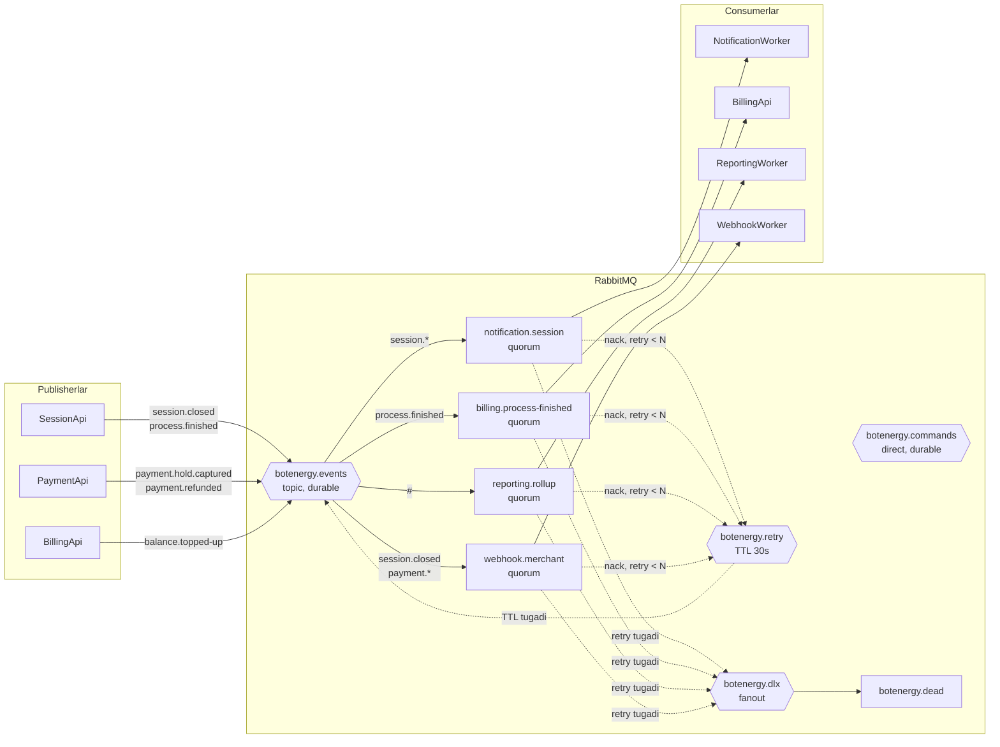

### 7.4 Exchange / routing key konvensiyasi

| Exchange | Turi | Routing key namunasi | Maqsad |
|---|---|---|---|
| `botenergy.events` | topic | `session.created`, `session.closed`, `process.started`, `process.finished`, `payment.hold.created`, `payment.hold.captured`, `payment.refunded`, `device.offline`, `user.registered` | Domain hodisalari, fan-out |
| `botenergy.commands` | direct | `notification.send-push`, `report.rebuild-daily` | Aniq bitta iste'molchiga topshiriq |
| `botenergy.retry` | topic | asl key saqlanadi | `message-ttl` + DLX orqali kechiktirilgan qayta urinish |
| `botenergy.dlx` | fanout | — | Qutqarib bo'lmagan xabarlar → qo'lda ko'rib chiqish |

Qoidalar:
- Barcha queue'lar **quorum** turida (klasterda ma'lumot yo'qotmaslik uchun; klassik mirrored queue eskirgan).
- Har bir consumer **o'z queue'siga** ega — queue nomi `{consumer}.{nima-eshitadi}` formatida. Bir queue'ni ikki xil consumer o'qimaydi.
- Xabar sxemasi versiyalanadi: `{ messageId, occurredAt, version, type, payload }`.
- `messageId` — idempotentlik kaliti.

### 7.5 Ikki majburiy pattern

**1. Transactional outbox.** "DB'ga yozdim, keyin RabbitMQ'ga yubordim" — ikkisining orasida jarayon o'lsa hodisa yo'qoladi. Yechim: hodisa **bir xil tranzaksiyada** `outbox_messages` jadvaliga yoziladi, alohida publisher uni o'qib yuboradi.

```csharp
// Mavjud ITransactionRunner bilan tabiiy mos tushadi
await _transactionRunner.RunAsync(async () =>
{
    await _sessionRepository.CloseAsync(sessionId);
    await _outbox.EnqueueAsync(new SessionClosedEvent(sessionId, userId, totalKwh));
});
// OutboxPublisherService (IHostedService) — 1s intervalda pending qatorlarni oladi,
// FOR UPDATE SKIP LOCKED bilan lock qiladi, publish qiladi, PublishedAt ni belgilaydi.
```

**2. Idempotent consumer.** At-least-once yetkazish takroriy xabarni kafolatlaydi.

```csharp
public async Task Consume(ConsumeContext<ProcessFinishedEvent> ctx)
{
    var key = $"mq:consumed:{nameof(BillingConsumer)}:{ctx.MessageId}";
    if (!await _redis.StringSetAsync(key, "1", TimeSpan.FromDays(2), When.NotExists))
        return;                       // allaqachon ishlangan
    await _billing.SettleAsync(ctx.Message);
}
```

### 7.6 Kutubxona tanlovi

**MassTransit** tavsiya qilinadi (`RabbitMQ.Client` xom API o'rniga): retry/circuit-breaker policy, DLQ, outbox (EF Core integratsiyasi bilan), consumer DI, OpenTelemetry instrumentatsiyasi — hammasi tayyor. Yagona minus — abstraksiya qatlami va MassTransit v8+ litsenziya siyosatiga e'tibor berish kerak. Alternativ: xom `RabbitMQ.Client` + o'z retry/outbox kodingiz (ko'proq mehnat, to'liq nazorat).

### 7.7 Xavfsizlik

- RabbitMQ faqat `be-data` docker tarmog'ida, `ports` publish qilinmaydi.
- `guest/guest` o'chiriladi; har bir servis uchun alohida user + vhost `/botenergy`, minimal permission (`configure`/`write`/`read` regex bilan cheklangan).
- Management UI (15672) tashqariga chiqarilmaydi — `ssh -L 15672:localhost:15672`.
- Parollar env var'dan (`RabbitMq__Password`).

---

## 8. Kelajakdagi TCP Socket server

### 8.1 Muammoning mohiyati

Hozir MQTT pipeline'i **SessionApi ichida qulflangan** (`WebApi/SessionApi/Mqtt/`). Agar ertaga TCP server kerak bo'lsa va u shu papkaga qarasa — yo kodni dublikat qilasiz, yo TcpGateway SessionApi'ga bog'lanib qoladi. Ikkalasi ham yomon.

### 8.2 Yechim: transportni pipeline'dan ajratish

MQTT-ga xos bo'lmagan qismlarni `Infrastructure/DeviceMessaging` kutubxonasiga ko'chiring:

```
Infrastructure/DeviceMessaging/          ← YANGI, transportdan mustaqil
├── Abstractions/
│   ├── IDeviceInboundPipeline.cs        // InvokeAsync(DeviceContext)
│   ├── IDeviceMiddleware.cs
│   ├── IDeviceMessageHandler.cs
│   └── IDeviceTransport.cs              // SendAsync(serial, envelope)
├── Envelopes/
│   ├── DeviceEnvelope.cs                // {id, type, timestamp, payload, hmac}
│   └── EnvelopeSerializer.cs
├── Middlewares/                          // MQTT'dan KO'CHIRILADI — o'zgarishsiz
│   ├── DeserializeMiddleware.cs
│   ├── DeviceAuthMiddleware.cs
│   ├── HmacValidationMiddleware.cs
│   ├── TimestampValidationMiddleware.cs
│   ├── ReplayValidationMiddleware.cs
│   └── DispatcherMiddleware.cs
├── Handlers/                             // SessionConnect, ProcessTelemetry, ...
└── Dispatching/

WebApi/SessionApi/Mqtt/                   ← faqat MQTT adapteri qoladi
├── Transport/{MqttHost, MqttConnection, MqttPublisher}
├── Topics/MqttTopics.cs
└── MqttTransportAdapter.cs               // IDeviceTransport implementatsiyasi

WebApi/TcpGateway/                        ← KELAJAK, yangi loyiha
├── Transport/{TcpHost, TcpConnectionHandler, FrameCodec}
└── TcpTransportAdapter.cs                // IDeviceTransport implementatsiyasi
```

Bu refaktoring **hozir** qilinishi mumkin va TCP kelmasa ham foyda beradi: middleware'lar unit-test qilinadigan bo'ladi va SessionApi yengillashadi.

### 8.3 TcpGateway skeleti

Kestrel'ning `ConnectionHandler` abstraksiyasi ishlatiladi — TLS, backpressure, graceful shutdown tayyor holda keladi:

```csharp
// WebApi/TcpGateway/Program.cs
var builder = WebApplication.CreateBuilder(args);
builder.AddBotEnergyLogging("TcpGateway");
builder.Configuration.AddCommonConfiguration();

builder.WebHost.ConfigureKestrel(o =>
{
    o.ListenAnyIP(9000, listen =>
    {
        listen.UseConnectionHandler<DeviceTcpConnectionHandler>();
        listen.UseHttps(/* /etc/botenergy/certs/device.pfx */);   // TLS to'g'ridan-to'g'ri
    });
});

builder.Services.AddInfrastructure(builder.Configuration);
builder.Services.AddRedisServices(builder.Configuration);
builder.Services.AddDeviceMessagingPipeline(typeof(SessionConnectHandler).Assembly); // BIR XIL pipeline
builder.Services.AddSingleton<IDeviceTransport, TcpTransportAdapter>();
```

```csharp
public sealed class DeviceTcpConnectionHandler : ConnectionHandler
{
    public override async Task OnConnectedAsync(ConnectionContext connection)
    {
        var input = connection.Transport.Input;
        while (true)
        {
            var result = await input.ReadAsync();
            var buffer = result.Buffer;

            // Length-prefixed framing: [4 bayt uzunlik][JSON envelope]
            while (FrameCodec.TryReadFrame(ref buffer, out var frame))
            {
                using var scope = _scopeFactory.CreateScope();
                var pipeline = scope.ServiceProvider.GetRequiredService<IDeviceInboundPipeline>();
                await pipeline.InvokeAsync(new DeviceContext
                {
                    SerialNumber = frame.Serial,
                    RawPayload = frame.Payload,
                    Transport = DeviceTransportKind.Tcp   // yagona farq
                });
            }

            input.AdvanceTo(buffer.Start, buffer.End);
            if (result.IsCompleted) break;
        }
    }
}
```

### 8.4 Nima o'zgarmaydi

| Element | TCP qo'shilganda |
|---|---|
| Envelope formati | O'zgarmaydi — `{id, type, timestamp, payload, hmac}` |
| HMAC / timestamp / replay | O'zgarmaydi — bir xil middleware |
| Handlerlar | O'zgarmaydi — `SessionConnectHandler` va h.k. |
| Biznes servislar | O'zgarmaydi — `SessionService`, `ProcessService` |
| SignalR bildirishnomalari | O'zgarmaydi |
| Replay counter'lar | O'zgarmaydi — Redis'da, transportdan mustaqil |
| Nginx / YARP | Tegilmaydi — TCP L7 proxy'dan o'tmaydi |
| Firewall | Bitta yangi port ochiladi (masalan, 9000/tcp) |

`IDeviceCommandPublisher` esa transport tanlaydi: qurilma qaysi transport bilan oxirgi marta ulangani `DeviceEntity.LastTransport` da saqlanadi va buyruq o'sha kanal orqali yuboriladi.

---

## 9. Domen strategiyasi va portlar

### 9.1 Nega hamma narsa 443'da bo'la olmaydi

Bu savolning javobi **protokol qatlamida**:

| Protokol | HTTP ustidami | 443'da path bo'yicha routing mumkinmi | Nega |
|---|---|---|---|
| REST API | ✅ | ✅ `/api/...` | HTTP so'rovda `Host` + path bor → L7 proxy o'qiy oladi |
| SignalR (WebSocket) | ✅ (HTTP upgrade) | ✅ `/hubs/...` | Ulanish HTTP GET + `Upgrade: websocket` bilan boshlanadi |
| MQTT over WebSocket | ✅ | ✅ `/mqtt` | Xuddi shunday — HTTP upgrade, subprotocol `mqtt` |
| **MQTT over TCP** | ❌ | ❌ | Xom TCP: ulanish `CONNECT` MQTT paketi bilan boshlanadi, HTTP header yo'q, path tushunchasi yo'q |
| **Kelajakdagi TCP protokol** | ❌ | ❌ | Xuddi shu sabab |

Ya'ni: **path bo'yicha multiplekslash faqat HTTP oilasidagi protokollarga tegishli.** ESP32 xom MQTT bilan ulanganda proxy'ga "men `/mqtt` ga ketyapman" deb ayta olmaydi — shuning uchun unga alohida port (8883, IANA'ning MQTT-over-TLS standarti) kerak.

**443'da xom MQTT'ni ham berish mumkin — TLS ALPN orqali.** TLS handshake'da klient `ALPN: mqtt` deb aytadi, Nginx `stream` moduli `ssl_preread` bilan uni ko'rib EMQX'ga yo'naltiradi:

```nginx
stream {
    map $ssl_preread_alpn_protocols $upstream {
        ~\bmqtt\b   emqx_mqtt;
        default     https_edge;
    }
    server {
        listen 443;
        ssl_preread on;
        proxy_pass $upstream;
    }
}
```

Bu **qat'iy korporativ firewall ortidagi** qurilmalar uchun zaxira yo'l sifatida foydali. Lekin default sifatida tavsiya qilmayman: qo'shimcha murakkablik, ESP32 tarafida ALPN qo'llab-quvvatlashini tekshirish kerak, va TLS'ni ikki marta terminate qilish (stream → EMQX) sozlamani chalkashtiradi. **8883 — asosiy, 443/ALPN — kelajakdagi zaxira.**

### 9.2 Yakuniy public endpointlar

```
https://company.uz/api/{servis}/...     REST API          → Nginx → YARP → servis
https://company.uz/hubs/session          SignalR (wss)     → Nginx → YARP → SessionApi
wss://company.uz/mqtt                    MQTT-over-WSS     → Nginx → EMQX :8083
mqtts://company.uz:8883                  MQTT-over-TLS     → EMQX to'g'ridan-to'g'ri
https://company.uz/                      Admin SPA (statik)→ Nginx
https://company.uz/health                Edge health       → Nginx → YARP
```

### 9.3 DNS

| Yozuv | Turi | Qiymat | Izoh |
|---|---|---|---|
| `company.uz` | A | VPS public IP | Apex |
| `www.company.uz` | CNAME | `company.uz` | 301 redirect |
| `mqtt.company.uz` | A | VPS public IP | Ixtiyoriy alias — kelajakda brokerni alohida serverga ko'chirsangiz DNS'ni o'zgartirasiz, qurilmalar firmware'ini emas |
| `company.uz` | CAA | `0 issue "letsencrypt.org"` | Boshqa CA sertifikat bera olmasin |

> **Kuchli tavsiya:** ESP32 firmware'iga `company.uz` emas, **`mqtt.company.uz`** yozing. Qurilmalarda hostname'ni o'zgartirish — dala tashrifi yoki OTA kampaniyasi. Alohida DNS nomi kelajakda brokerni ko'chirish imkonini bepul beradi.

### 9.4 Nginx konfiguratsiyasi — `deploy/nginx/botenergy.conf`

```nginx
# --- Rate limit zonalari (birinchi mudofaa chizig'i) ---
limit_req_zone  $binary_remote_addr zone=api_zone:10m  rate=20r/s;
limit_req_zone  $binary_remote_addr zone=auth_zone:10m rate=2r/s;
limit_conn_zone $binary_remote_addr zone=conn_zone:10m;

# WebSocket upgrade mapping
map $http_upgrade $connection_upgrade {
    default upgrade;
    ''      close;
}

# Loglarda tokenni yashirish
map $request_uri $safe_uri {
    ~^(?<p>[^?]*)\?.*access_token=.*$  "$p?access_token=***";
    default                            $request_uri;
}
log_format botenergy '$remote_addr - $status "$request_method $safe_uri" '
                     'rt=$request_time urt=$upstream_response_time '
                     'reqid=$http_x_request_id ua="$http_user_agent"';

server {
    listen 80;
    server_name company.uz www.company.uz mqtt.company.uz;
    location /.well-known/acme-challenge/ { root /var/www/certbot; }
    location / { return 301 https://$host$request_uri; }
}

server {
    listen 443 ssl;
    http2 on;
    server_name company.uz www.company.uz;
    access_log /var/log/nginx/botenergy.log botenergy;

    ssl_certificate     /etc/letsencrypt/live/company.uz/fullchain.pem;
    ssl_certificate_key /etc/letsencrypt/live/company.uz/privkey.pem;
    ssl_protocols       TLSv1.2 TLSv1.3;
    ssl_ciphers         ECDHE-ECDSA-AES128-GCM-SHA256:ECDHE-RSA-AES128-GCM-SHA256:ECDHE-ECDSA-AES256-GCM-SHA384:ECDHE-RSA-AES256-GCM-SHA384;
    ssl_prefer_server_ciphers off;
    ssl_session_cache   shared:SSL:10m;
    ssl_stapling on;
    ssl_stapling_verify on;

    add_header Strict-Transport-Security "max-age=63072000; includeSubDomains" always;
    add_header X-Content-Type-Options    "nosniff" always;
    add_header X-Frame-Options           "DENY" always;
    add_header Referrer-Policy           "strict-origin-when-cross-origin" always;
    server_tokens off;

    client_max_body_size 10m;
    client_body_timeout  15s;
    client_header_timeout 15s;
    limit_conn conn_zone 50;

    # --- Auth endpointlari: eng qattiq limit ---
    location /api/auth/ {
        limit_req zone=auth_zone burst=5 nodelay;
        proxy_pass http://gateway:8080;
        include /etc/nginx/snippets/proxy-common.conf;
    }

    # --- Qolgan REST API ---
    location /api/ {
        limit_req zone=api_zone burst=40 nodelay;
        proxy_pass http://gateway:8080;
        include /etc/nginx/snippets/proxy-common.conf;
    }

    # --- SignalR: uzoq yashovchi WebSocket ---
    location /hubs/ {
        access_log off;                       # token query-string'da — logga yozmaymiz
        proxy_pass http://gateway:8080;
        include /etc/nginx/snippets/proxy-common.conf;
        proxy_http_version 1.1;
        proxy_set_header Upgrade    $http_upgrade;
        proxy_set_header Connection $connection_upgrade;
        proxy_read_timeout  3600s;
        proxy_send_timeout  3600s;
        proxy_buffering off;                  # real-time push buferlanmasin
    }

    # --- MQTT over WebSocket: to'g'ridan-to'g'ri EMQX ga, YARP'siz ---
    location /mqtt {
        proxy_pass http://emqx:8083;
        proxy_http_version 1.1;
        proxy_set_header Upgrade    $http_upgrade;
        proxy_set_header Connection $connection_upgrade;
        proxy_set_header Host       $host;
        proxy_set_header X-Real-IP  $remote_addr;
        proxy_set_header X-Forwarded-For  $proxy_add_x_forwarded_for;
        proxy_set_header X-Forwarded-Port $server_port;
        proxy_read_timeout 3600s;
        proxy_send_timeout 3600s;
    }

    location /health { proxy_pass http://gateway:8080/health/live; access_log off; }

    # --- Admin SPA (statik) ---
    location / {
        root /var/www/botenergy-admin;
        try_files $uri $uri/ /index.html;
    }
}
```

`snippets/proxy-common.conf`:

```nginx
proxy_set_header Host              $host;
proxy_set_header X-Real-IP         $remote_addr;
proxy_set_header X-Forwarded-For   $proxy_add_x_forwarded_for;
proxy_set_header X-Forwarded-Proto $scheme;
proxy_set_header X-Request-Id      $request_id;
proxy_connect_timeout 5s;
proxy_read_timeout    60s;
```

---

## 10. Xavfsizlik arxitekturasi

### 10.1 Xavfsizlik oqimi — uch xil aktor

```mermaid
graph TB
    subgraph U["Mobil foydalanuvchi"]
        U1["1. POST /api/auth/Auth/Login<br/>telefon + parol/OTP"]
        U2["2. AuthApi: PBKDF2 600k tekshiruv"]
        U3["3. access 15m (aud=Customer)<br/>+ refresh 7d (c: prefiks)"]
        U4["4. Har so'rov: Bearer token"]
        U5["5. Gateway: imzo+aud+muddat"]
        U6["6. Servis: JWT qayta + PermissionFilter"]
        U7["7. AccessScope: Merchant/Org filtri"]
    end

    subgraph D["ESP32 qurilma"]
        D1["1. TLS handshake :8883<br/>server sertifikatini tekshiradi"]
        D2["2. CONNECT clientId=serial<br/>user=serial pass=MqttPassword"]
        D3["3. EMQX → DeviceApi authn hook"]
        D4["4. ACL: device/{serial}/* publish<br/>server/{serial}/* subscribe"]
        D5["5. Envelope HMAC-SHA256<br/>SecretKey bilan, constant-time"]
        D6["6. Timestamp oynasi + monoton id<br/>replay himoyasi (Redis)"]
    end

    subgraph S["Servis → servis"]
        S1["Docker internal tarmoq<br/>host'ga chiqmaydi"]
        S2["X-Internal-Secret header<br/>internal endpointlar uchun"]
        S3["Kelajak: mTLS yoki<br/>client_credentials JWT"]
    end

    U1-->U2-->U3-->U4-->U5-->U6-->U7
    D1-->D2-->D3-->D4-->D5-->D6
    S1-->S2-->S3
```

### 10.2 Qatlamlar bo'yicha nazorat

| Qatlam | Nazorat | Holat |
|---|---|---|
| Tarmoq | ufw: faqat 22/80/443/8883; backend portlar docker internal tarmoqda | ❌ qilinishi kerak |
| Transport | TLS 1.2/1.3, HSTS 2 yil, OCSP stapling, CAA yozuvi | ❌ (hozir TLS umuman yo'q) |
| Edge | Nginx `limit_req` + `limit_conn`, `server_tokens off`, xavfsizlik header'lari | ❌ |
| Gateway | JWT tekshiruv, audience, per-user rate limit, CORS allowlist, audit | ❌ |
| Servis | JWT qayta tekshiruv, `PermissionFilter`, `AccessScope` | ✅ mavjud |
| Domen | PBKDF2 600k, refresh rotation, idempotency, atomik balans | ✅ mavjud |
| Qurilma | Per-device credential + ACL + HMAC + replay counter | ⚠️ HMAC/replay bor, credential/ACL yo'q |
| Ma'lumot | Postgres `scram-sha-256`, disk shifrlash, backup shifrlash | ⚠️ |
| Sirlar | Env var + `EnvironmentFile` 0600 / Docker secrets | ❌ (git'da) |

### 10.3 JWT strategiyasi

Mavjud dizayn to'g'ri, faqat ikkita tuzatish:

| Element | Hozir | Tavsiya |
|---|---|---|
| Access token | 15 daqiqa | O'zgarishsiz |
| Refresh token | 7 kun, rotatsiyali, `c:`/`p:` prefiks | O'zgarishsiz — yaxshi dizayn |
| Audience | `JwtAudiences.Customer` / `.Platform` | O'zgarishsiz |
| **Issuer** | `ValidateIssuer = false` | ✅ **Yoqing** — `iss: "https://company.uz"`. Boshqa tizim sizning secret'ingiz bilan token yasab yubormasin |
| **Algoritm** | HMAC-SHA256 (symmetric) | Bosqich 2'da **RS256** ga o'ting: gateway faqat public key bilan tekshiradi, secret faqat AuthApi'da qoladi |
| Secret uzunligi | 96 belgi | O'zgarishsiz, lekin **rotatsiya qilinishi shart** (git'da bo'lgan) |
| Clock skew | Default 5 daqiqa | `ClockSkew = TimeSpan.FromSeconds(30)` |

> **RS256 nega muhim:** hozir gateway ham, 7 ta servis ham bir xil **imzolash** kalitiga ega. Bitta servis buzilsa — hujumchi istalgan foydalanuvchi (jumladan Manage admin) nomidan token yasaydi. RS256'da faqat AuthApi private key'ni biladi, qolganlari public key bilan tekshiradi. Bu bitta konfiguratsiya o'zgarishi va katta xavfsizlik yutug'i.

### 10.4 Sertifikat strategiyasi

Uchta alohida ehtiyoj, uchta yechim:

| Maqsad | Sertifikat | Yangilanish | Izoh |
|---|---|---|---|
| `https://company.uz` (443) | Let's Encrypt, SAN: `company.uz`, `www`, `mqtt` | certbot, avtomatik 60 kunda | Nginx terminate qiladi |
| `mqtts://company.uz:8883` | **Xuddi shu** LE sertifikati | certbot deploy-hook EMQX'ga nusxalaydi + reload | Bitta CA — ESP32 faqat ISRG Root X1 ni saqlaydi |
| Qurilma identifikatsiyasi (kelajak, mTLS) | **Xususiy CA** — o'zingiz chiqarasiz | Ishlab chiqarishda qurilmaga yoziladi, 5–10 yil | LE klient sertifikat bermaydi |

certbot deploy hook:

```bash
#!/bin/bash
# /etc/letsencrypt/renewal-hooks/deploy/botenergy-emqx.sh
set -e
DOMAIN=company.uz
install -o 1000 -g 1000 -m 0644 /etc/letsencrypt/live/$DOMAIN/fullchain.pem /opt/botenergy/emqx/certs/fullchain.pem
install -o 1000 -g 1000 -m 0600 /etc/letsencrypt/live/$DOMAIN/privkey.pem   /opt/botenergy/emqx/certs/privkey.pem
docker exec botenergy-emqx emqx ctl listeners restart ssl:default
docker exec botenergy-nginx nginx -s reload
```

> **ESP32 uchun juda muhim:** firmware'ga **root CA** (ISRG Root X1) ni yozing, leaf sertifikatni **emas**. Leaf har 60 kunda o'zgaradi — agar uni pin qilsangiz, birinchi renewal'da butun parkingiz oflayn bo'ladi. Root X1 2035-yilgacha amal qiladi. Zaxira sifatida ikkita root'ni (ISRG X1 + X2) saqlang.

### 10.5 MQTT xavfsizligi — qatlamlar

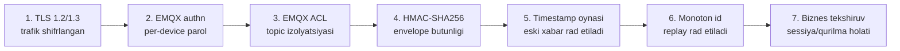

Bir qatlam yiqilsa keyingisi ushlab qoladi:

| Ssenariy | Qaysi qatlam to'xtatadi |
|---|---|
| Trafikni tinglash | 1 (TLS) |
| Boshqa qurilma nomidan ulanish | 2 + 3 (clientId ≠ username → deny) |
| Ulangan qurilma boshqa serialga publish qiladi | 3 (ACL) |
| Broker paroli o'g'irlangan, payload o'zgartirilgan | 4 (HMAC — `SecretKey` alohida sir) |
| Eski to'g'ri xabar qayta yuborilgan | 5 + 6 |
| Qurilma EEPROM'i o'chirilgan, counter 0 dan boshlandi | 6 → xabarlar rad etiladi, admin `ResetMqttCounters` bilan ochadi (ataylab qo'lda) |

**MQTT paroli va HMAC `SecretKey` — ikki xil sir bo'lishi shart.** Agar broker paroli sifatida `SecretKey` ishlatilsa, EMQX authn hook'i uni ko'radi va HMAC qatlami ma'nosini yo'qotadi.

### 10.6 Servis-servis autentifikatsiya

Uch bosqich, murakkablik o'sishi tartibida:

1. **Hozir (minimal, lekin yetarli):** servislar public tarmoqda umuman ko'rinmaydi (docker internal network). Internal endpointlar (`/internal/mqtt/authn`) `X-Internal-Secret` header'i bilan himoyalanadi — mavjud `InternalApi:SharedSecret` shu maqsadda. Secret env var'dan keladi, constant-time solishtiriladi.
2. **Bosqich 2:** har servisga o'z sirini bering (bitta umumiy o'rniga) — buzilgan servis boshqasiga o'tib keta olmaydi.
3. **Bosqich 3 (ko'p node'da):** mTLS servis-servis, yoki `client_credentials` grant bilan qisqa muddatli JWT. Node'lar orasidagi trafik shifrlanadi.

```csharp
public sealed class InternalSecretFilter : IAsyncActionFilter
{
    private readonly byte[] _expected;
    public async Task OnActionExecutionAsync(ActionExecutingContext ctx, ActionExecutionDelegate next)
    {
        var provided = ctx.HttpContext.Request.Headers["X-Internal-Secret"].FirstOrDefault();
        if (provided is null ||
            !CryptographicOperations.FixedTimeEquals(Encoding.UTF8.GetBytes(provided), _expected))
        {
            ctx.Result = new UnauthorizedResult();
            return;
        }
        await next();
    }
}
```

### 10.7 Sirlarni boshqarish

**Hozirgi holat qabul qilib bo'lmaydi:** `Configuration.Production.json` git'da, ichida ishlaydigan DB paroli, JWT secret, MQTT paroli.

Tuzatish tartibi (bu ketma-ketlik muhim):

```bash
# 1. Barcha sirlarni ROTATSIYA qiling — git history'dan o'chirish yetarli emas,
#    ular allaqachon oshkor bo'lgan deb hisoblang
#    - PostgreSQL: ALTER USER botenergy_user WITH PASSWORD '<yangi>';
#    - JWT secret: openssl rand -base64 64   (barcha foydalanuvchilar qayta login qiladi)
#    - MQTT parol, InternalApi secret, Seed:AdminPassword

# 2. Faylni placeholder'ga o'tkazing (CLAUDE.md aytgan holatga keltiring)
#    "Jwt": { "Secret": "Env_Jwt__Secret" }  → ResolveSecret uni "yo'q" deb biladi

# 3. Serverda env fayl
sudo install -m 0600 -o root -g root /dev/null /etc/botenergy/botenergy.env
sudo tee /etc/botenergy/botenergy.env >/dev/null <<'EOF'
ConnectionStrings__DefaultConnection=Host=postgres;Port=5432;Database=botenergy_db;Username=botenergy_user;Password=...
Jwt__Secret=...
Mqtt__Password=...
InternalApi__SharedSecret=...
Seed__AdminPassword=...
RabbitMq__Password=...
EOF

# 4. Git history tozalash (barcha klonlar qayta klon qilinishi kerak)
git filter-repo --path Infrastructure/CommonConfiguration/ConfigurationFile/Configuration.Production.json --invert-paths
```

Docker compose'da: `env_file: /etc/botenergy/botenergy.env`. Systemd'da: `EnvironmentFile=/etc/botenergy/botenergy.env`.

**Kelajak:** 3+ node yoki 3+ dev bo'lganda — HashiCorp Vault yoki Infisical. Hozircha 0600 huquqli env fayl + `git-secrets` pre-commit hook yetarli.

### 10.8 Firewall

```bash
sudo ufw default deny incoming
sudo ufw default allow outgoing
sudo ufw allow from <ofis-IP>/32 to any port 22 proto tcp comment 'SSH admin'
sudo ufw allow 80/tcp   comment 'ACME + redirect'
sudo ufw allow 443/tcp  comment 'HTTPS/WSS'
sudo ufw allow 8883/tcp comment 'MQTTS devices'
sudo ufw enable

# Docker ufw'ni aylanib o'tadi — DOCKER-USER chain'ida ham to'sing
sudo tee /etc/docker/daemon.json >/dev/null <<'EOF'
{ "iptables": true, "ip-forward": true, "userland-proxy": false }
EOF
```

Qo'shimcha:
- `fail2ban` — SSH + Nginx `limit_req` loglariga jail.
- SSH: `PasswordAuthentication no`, `PermitRootLogin no`, faqat kalit.
- Avtomatik xavfsizlik yangilanishlari: `unattended-upgrades`.

### 10.9 DDoS

| Qatlam | Chora | Kim uchun |
|---|---|---|
| DNS/Edge | **Cloudflare proxy** (443 uchun) — L3/L4 yutish, bot management, WAF | REST + SignalR + WSS |
| Nginx | `limit_req`, `limit_conn 50`, `client_body_timeout 15s` (slowloris) | Hammasi |
| Gateway | Per-IP 300/min + per-user token bucket | REST |
| EMQX | `max_connections`, `max_conn_rate`, `max_packet_size 64KB` | MQTT |
| Postgres | PgBouncer connection limit — DB'ni ulanish toshqinidan saqlaydi | Hammasi |

> **Cloudflare cheklovi:** CF free/pro rejalarida faqat HTTP(S) proxy qilinadi. **8883 porti CF orqali o'tmaydi** — MQTT trafigi to'g'ridan-to'g'ri VPS IP'ga boradi va origin IP oshkor bo'ladi. Variantlar: (a) MQTT'ni himoyasiz qoldirish + EMQX rate limit (boshlanish uchun yetarli), (b) CF Spectrum (pullik, L4 proxy), (c) provayder darajasidagi DDoS himoyasi (OVH, Hetzner default beradi). `mqtt.company.uz` uchun alohida DNS yozuvi CF proxy'siz ("grey cloud") qoldiriladi.

---

## 11. Masshtablanish

### 11.1 Yuk hisobi — konkret raqamlar

Maqsadli holat: 100 000 ro'yxatdan o'tgan, 5 000 bir vaqtda, 10 000 qurilma.

| Resurs | Hisob | Natija | Xulosa |
|---|---|---|---|
| SignalR ulanishlar | 5 000 × ~40 KB (buffer + state) | ~200 MB RAM | Bitta instansiya bemalol |
| MQTT ulanishlar | 10 000 × ~15 KB (EMQX) | ~150 MB + TLS session | EMQX bitta node'da 100k+ ko'taradi |
| MQTT telemetriya | 10% zaryadlanmoqda = 1 000 qurilma × 1 msg/5s | **200 msg/s** | EMQX uchun hech narsa emas |
| Telemetriya INSERT | 200 INSERT/s, har biri alohida tranzaksiya | **Postgres uchun muammo** | Batching shart (§11.4) |
| REST RPS | 5 000 klient × 1 so'rov/10s | **500 RPS** | 2 vCPU'da bitta .NET servis 5–10k RPS beradi; gateway ham shuncha |
| Telemetriya hajmi | 200/s × 86400 = 17 mln qator/kun × ~200 bayt | **~3.5 GB/kun** | Partitioning + retention shart (§11.4) |

**Asosiy xulosa:** compute (API, gateway, broker) bu yukda muammo emas. **Yagona haqiqiy bo'g'iz — PostgreSQL'ga telemetriya yozish va uning o'sishi.**

### 11.2 Bosqichma-bosqich masshtablash

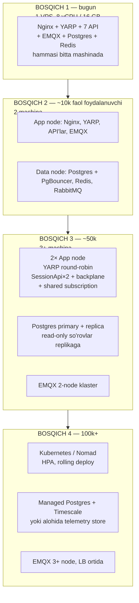

Muhimi: **1→2→3 bosqichlarida kod o'zgarmaydi.** Faqat konfiguratsiya (destination ro'yxati, connection string) va uchta oldindan qilingan tayyorgarlik:

| Tayyorgarlik | Qachon qilinadi | Nega oldindan |
|---|---|---|
| SignalR Redis backplane | Hozir | Keyin qo'shsangiz — xatolik faqat prodda, ikkinchi replika chiqqanda ko'rinadi |
| MQTT unikal ClientId + shared subscription | Hozir | Aks holda ikkinchi replika birinchisini uzadi (§6.6) |
| Stateless servislar (in-memory state yo'q) | Hozir | `IOtpService` **singleton, in-memory** — replikalar orasida bo'linmaydi (§11.5) |

### 11.3 Health check'larni ajratish

Hozir har API'da bitta `/health` bor va u DB + Redis'ni tekshiradi. Bu **liveness** sifatida ishlatilsa xavfli: Postgres 30 soniya sekinlashsa, orchestrator barcha 7 servisni bir vaqtda restart qiladi va vaziyat yomonlashadi.

```csharp
// AddInfrastructure ichida
services.AddHealthChecks()
    .AddCheck<DbHealthCheck>("database", tags: new[] { "ready" })
    .AddCheck<RedisHealthCheck>("redis",  tags: new[] { "ready" });

// Program.cs
app.MapHealthChecks("/health/live",  new HealthCheckOptions { Predicate = _ => false });   // jarayon tirikmi
app.MapHealthChecks("/health/ready", new HealthCheckOptions { Predicate = h => h.Tags.Contains("ready") });
app.MapHealthChecks("/health");      // orqaga moslik uchun
```

- `/health/live` → Docker `healthcheck`, systemd watchdog. Faqat "jarayon javob beryaptimi".
- `/health/ready` → YARP active health check. "Trafik yuborsa bo'ladimi".

### 11.4 PostgreSQL — asosiy bo'g'iz

Uchta chora, muhimlik tartibida:

**1. Telemetriya yozuvini batch qilish.** Har telemetriya xabari uchun alohida `SaveChangesAsync` — 200 tranzaksiya/s. O'rniga `Channel<T>` buferi + har 1–2 soniyada `COPY`/bulk insert:

```csharp
public sealed class TelemetryBatchWriter : BackgroundService
{
    private readonly Channel<TelemetryRow> _channel =
        Channel.CreateBounded<TelemetryRow>(new BoundedChannelOptions(50_000)
        { FullMode = BoundedChannelFullMode.DropOldest });   // telemetriya — yo'qotish tolerant

    public bool TryWrite(TelemetryRow row) => _channel.Writer.TryWrite(row);

    protected override async Task ExecuteAsync(CancellationToken ct)
    {
        var buffer = new List<TelemetryRow>(1000);
        using var timer = new PeriodicTimer(TimeSpan.FromSeconds(1));
        while (await timer.WaitForNextTickAsync(ct))
        {
            while (buffer.Count < 1000 && _channel.Reader.TryRead(out var row)) buffer.Add(row);
            if (buffer.Count == 0) continue;

            using var scope = _scopeFactory.CreateScope();
            var conn = scope.ServiceProvider.GetRequiredService<AppDbContext>()
                            .Database.GetDbConnection() as NpgsqlConnection;
            await using var writer = await conn!.BeginBinaryImportAsync(
                "COPY session.telemetry (process_id, voltage, current, kwh, created_date) FROM STDIN (FORMAT BINARY)", ct);
            foreach (var r in buffer) { /* writer.StartRow(); writer.Write(...) */ }
            await writer.CompleteAsync(ct);
            buffer.Clear();
        }
    }
}
```

200 tranzaksiya/s → **1 tranzaksiya/s**. Bu eng katta bitta yutuq.

**2. Partitioning.** Telemetriya jadvali oyiga bo'linadi:

```sql
CREATE TABLE session.telemetry (
    id bigserial,
    process_id uuid NOT NULL,
    created_date timestamp NOT NULL DEFAULT LOCALTIMESTAMP,
    ...
) PARTITION BY RANGE (created_date);

CREATE TABLE session.telemetry_2026_08 PARTITION OF session.telemetry
    FOR VALUES FROM ('2026-08-01') TO ('2026-09-01');
```

Eski partitsiyani `DETACH` + arxivlash — `DELETE` dan minglab marta tez. Retention: xom telemetriya 90 kun, undan keyin faqat agregat.

> **Diqqat:** partitsiyalangan jadvalda `IsDeleted` global query filter va soft delete konvensiyasi saqlanadi, lekin telemetriya uchun soft delete ma'nosiz — bu jadval **append-only**, o'chirish faqat retention orqali partition drop bilan bo'ladi. Bu loyihaning "hard delete yo'q" qoidasidan ongli istisno bo'lishi kerak va hujjatlashtirilishi lozim.

**3. PgBouncer + read replica.** 7 servis × 2 replika × 100 pool = 1400 ulanish — Postgres default `max_connections=100`. PgBouncer (transaction pooling) o'rtada turadi. Hisobotlar (`ReportController`, `MerchantReport`, `OrganizationReport`) read replica'ga yo'naltiriladi — bu OLTP yukini og'ir `GROUP BY` so'rovlaridan ajratadi.

### 11.5 Stateless bo'lish — hozirgi to'siqlar

Replika qo'shishdan oldin tuzatilishi kerak:

| Komponent | Muammo | Yechim |
|---|---|---|
| `IOtpService` (singleton, in-memory) | 1-instansiyada yaratilgan OTP 2-instansiyada topilmaydi → login tasodifiy ishlamaydi | Redis'ga ko'chirish (TTL allaqachon bor — tabiiy moslik) |
| `MqttConnection` ClientId | Bir xil ID → instansiyalar bir-birini uzadi | §6.6 |
| `IdleSessionCleanerService`, `HoldInvoiceWatcher` | Har replikada parallel ishlaydi → ikki marta bajarish | Redis distributed lock (`SET NX PX`) yoki `FOR UPDATE SKIP LOCKED` (watcher'da `LeaseSeconds` bor — allaqachon to'g'ri yo'lda) |
| `InMemoryRefreshTokenStore` fallback | Redis yiqilganda tokenlar instansiyaga bog'lanadi | Qabul qilinadigan degradatsiya, o'zgartirish shart emas |
| Rate limiter | In-memory, replika soniga ko'payadi | Tolerant; qat'iy kerak bo'lsa Redis-backed |

---

## 12. Infratuzilma — komponentlar va mas'uliyat

| Komponent | Versiya | Mas'uliyat | Nega aynan shu |
|---|---|---|---|
| **Nginx** | 1.25+ | TLS termination, HTTP/2, statik fayllar, edge rate limit, `/mqtt` WSS proxy, ACME | Sertifikat avtomatizatsiyasi, YARP restart'idan mustaqil 443, sinovdan o'tgan TLS stek |
| **YARP** | 2.x | Route → servis, JWT tekshiruv, per-user rate limit, audit, Swagger agg., health-aware LB | .NET ichida, konfiguratsiya kod bilan bir repo'da, `HttpContext.User` mavjud → biznes-kontekstli qarorlar |
| **EMQX** | 5.x OSS | MQTT broker: TCP/TLS/WS/WSS listener, authn/authz hook, shared subscription, retained, Prometheus | Bitta broker barcha transportlar uchun; klasterga o'sish yo'li ochiq; HTTP hook bilan o'z DB'ingizga bog'lanadi |
| **PostgreSQL** | 16 + PostGIS 3.4 | Yagona source of truth; `geography(Point)` stansiya koordinatalari | Loyiha allaqachon unda; PostGIS stansiya qidiruvi uchun shart |
| **PgBouncer** | 1.22 | Connection pooling (transaction mode) | Bosqich 2'dan boshlab; replikalar ko'payganda majburiy |
| **Redis** | 7.x | Refresh token, idempotency, MQTT replay counter, SignalR backplane, distributed lock, cache | Allaqachon 3 vazifada ishlatilmoqda; backplane va lock — tabiiy kengaytma |
| **RabbitMQ** | 3.13 | Servislararo asinxron hodisalar (§7.2 trigger'i paydo bo'lganda) | Quorum queue, DLQ, retry — MQTT bermaydigan kafolatlar |
| **Docker + Compose** | 24+ / v2 | Paketlash, izolyatsiya, deterministik deploy, tarmoq segmentatsiyasi | 1–3 node uchun to'g'ri tanlov (§12.1) |
| **Prometheus** | 2.x | Metrikalar | Standart, barcha komponentlarda exporter bor |
| **Loki + Promtail** | 3.x | Log agregatsiyasi | Serilog JSON → Loki; Grafana'da metrika bilan bir joyda |
| **Tempo** | 2.x | Distributed tracing | OTLP, Grafana bilan integratsiya |
| **Grafana + Alertmanager** | 11.x | Dashboard + alert (Telegram) | Bitta UI: log, metrika, trace |

### 12.1 Docker Compose vs Kubernetes

**Tavsiya: Docker Compose.** 

| Mezon | Compose | Kubernetes |
|---|---|---|
| Node soni | 1–3 | 3+ (control plane overhead) |
| Jamoa hajmi | 1–5 dev | 5+ yoki maxsus DevOps |
| O'rganish vaqti | Kunlar | Oylar |
| Auto-scaling | Yo'q (qo'lda `--scale`) | HPA/VPA |
| Self-healing | `restart: unless-stopped` + healthcheck | To'liq |
| Sizning holatingiz | ✅ | ❌ hozircha |

K8s'ga o'tish **trigger'lari**: (a) 3+ node kerak bo'ldi, (b) trafik kunlik 5×+ tebranadi va auto-scaling pul tejaydi, (c) jamoada K8s biladigan odam paydo bo'ldi, (d) SLA zero-downtime deploy talab qiladi. Shu paytgacha Compose'da qolish — **ongli qaror**, orqada qolish emas. Compose fayllari K8s manifestlariga `kompose` bilan boshlang'ich konvertatsiya qilinadi, lekin baribir qo'lda qayta yozish kerak bo'ladi.

### 12.2 `deploy/docker-compose.yml`

```yaml
name: botenergy

x-api-common: &api-common
  restart: unless-stopped
  env_file: /etc/botenergy/botenergy.env
  environment:
    ASPNETCORE_ENVIRONMENT: Production
    OTEL_EXPORTER_OTLP_ENDPOINT: http://tempo:4317
  networks: [be-app, be-data]
  healthcheck:
    test: ["CMD", "curl", "-fsS", "http://localhost:${PORT}/health/live"]
    interval: 15s
    timeout: 3s
    retries: 3
    start_period: 30s
  logging:
    driver: json-file
    options: { max-size: "50m", max-file: "3" }
  deploy:
    resources:
      limits: { memory: 512M }

networks:
  be-edge: {}
  be-app:  { internal: true }
  be-data: { internal: true }

volumes:
  pgdata: {}
  redisdata: {}
  emqxdata: {}
  rabbitdata: {}

services:
  nginx:
    image: nginx:1.25-alpine
    restart: unless-stopped
    ports: ["80:80", "443:443"]
    volumes:
      - ./nginx/botenergy.conf:/etc/nginx/conf.d/default.conf:ro
      - ./nginx/snippets:/etc/nginx/snippets:ro
      - /etc/letsencrypt:/etc/letsencrypt:ro
      - /var/www/certbot:/var/www/certbot:ro
      - /var/www/botenergy-admin:/var/www/botenergy-admin:ro
    networks: [be-edge, be-app]
    depends_on: [gateway]

  gateway:
    <<: *api-common
    image: ghcr.io/company/botenergy-gateway:${TAG}
    environment: { PORT: 8080, ASPNETCORE_ENVIRONMENT: Production }
    networks: [be-app, be-data]

  authapi:    { <<: *api-common, image: "ghcr.io/company/botenergy-authapi:${TAG}",    environment: { PORT: 5002 } }
  userapi:    { <<: *api-common, image: "ghcr.io/company/botenergy-userapi:${TAG}",    environment: { PORT: 5006 } }
  adminapi:   { <<: *api-common, image: "ghcr.io/company/botenergy-adminapi:${TAG}",   environment: { PORT: 5001 } }
  billingapi: { <<: *api-common, image: "ghcr.io/company/botenergy-billingapi:${TAG}", environment: { PORT: 5003 } }
  paymentapi: { <<: *api-common, image: "ghcr.io/company/botenergy-paymentapi:${TAG}", environment: { PORT: 5005 } }
  deviceapi:  { <<: *api-common, image: "ghcr.io/company/botenergy-deviceapi:${TAG}",  environment: { PORT: 5004 } }
  sessionapi: { <<: *api-common, image: "ghcr.io/company/botenergy-sessionapi:${TAG}", environment: { PORT: 5007 } }

  emqx:
    image: emqx/emqx:5.8
    restart: unless-stopped
    ports: ["8883:8883"]            # FAQAT shu port tashqariga
    volumes:
      - ./emqx/emqx.conf:/opt/emqx/etc/emqx.conf:ro
      - /opt/botenergy/emqx/certs:/etc/emqx/certs:ro
      - emqxdata:/opt/emqx/data
    networks: [be-edge, be-app]
    ulimits: { nofile: { soft: 65536, hard: 65536 } }

  postgres:
    image: postgis/postgis:16-3.4
    restart: unless-stopped
    env_file: /etc/botenergy/botenergy.env
    volumes: [pgdata:/var/lib/postgresql/data]
    networks: [be-data]
    command: >
      postgres -c max_connections=200 -c shared_buffers=4GB
               -c effective_cache_size=12GB -c work_mem=16MB
               -c maintenance_work_mem=512MB -c wal_compression=on
    healthcheck:
      test: ["CMD-SHELL", "pg_isready -U botenergy_user -d botenergy_db"]
      interval: 10s

  redis:
    image: redis:7-alpine
    restart: unless-stopped
    command: ["redis-server", "--appendonly", "yes", "--maxmemory", "1gb", "--maxmemory-policy", "noeviction"]
    volumes: [redisdata:/data]
    networks: [be-data]

  rabbitmq:
    image: rabbitmq:3.13-management-alpine
    restart: unless-stopped
    env_file: /etc/botenergy/botenergy.env
    volumes:
      - rabbitdata:/var/lib/rabbitmq
      - ./rabbitmq/definitions.json:/etc/rabbitmq/definitions.json:ro
    networks: [be-data]
```

> **`maxmemory-policy noeviction` nega:** Redis'da refresh token va MQTT replay counter'lar saqlanadi. `allkeys-lru` bo'lsa xotira to'lganda Redis **replay counter'ni jimgina o'chiradi** va replay himoyasi buziladi. `noeviction` — to'lganda yozish xatosi qaytadi, bu jim buzilishdan yaxshiroq. Cache uchun alohida Redis DB yoki instansiya ishlating.

---

## 13. Deployment

### 13.1 Hozirgi deploy jarayonining muammolari

`deploy.sh` + `.github/workflows/deploy.yml` ni tahlil qilganda:

| Muammo | Oqibat |
|---|---|
| `dotnet restore` + `publish` **prod mashinada** bajariladi | Deploy paytida CPU/RAM cho'qqisi — ishlab turgan servislar sekinlashadi; prodda .NET SDK kerak |
| Har push'da **7 ta servis ham** qayta quriladi va restart qilinadi | Bitta satr o'zgarsa ham butun platforma uziladi |
| `sudo rm -rf /home/ubuntu/botenergy/$SERVICE` — keyin nusxalash | Restart oynasida fayllar yo'q; **rollback imkoni yo'q** |
| Health tekshiruvi yo'q | Servis ishga tushmasa ham workflow "✅ muvaffaqiyatli" deydi |
| Migration har bootda avtomatik, 7 servis bir vaqtda ko'tariladi | 7 ta jarayon bir vaqtda `Database.MigrateAsync()` chaqiradi → advisory lock kutishi, eng yomon holatda deadlock |
| Artifact versiyalanmagan | "Qaysi commit prodda?" — javob yo'q |

### 13.2 Tavsiya etilgan CI/CD

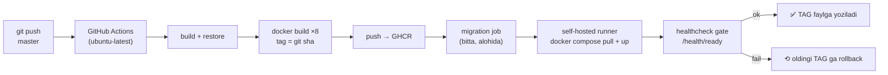

```yaml
# .github/workflows/deploy.yml (qayta yozilgan)
name: BotEnergy Deploy
on:
  push: { branches: [master] }

env:
  REGISTRY: ghcr.io
  TAG: ${{ github.sha }}

jobs:
  build:
    runs-on: ubuntu-latest          # prod mashinada EMAS
    permissions: { contents: read, packages: write }
    strategy:
      matrix:
        service: [Gateway, AuthApi, UserApi, AdminApi, BillingApi, PaymentApi, DeviceApi, SessionApi]
    steps:
      - uses: actions/checkout@v4
      - uses: docker/setup-buildx-action@v3
      - uses: docker/login-action@v3
        with:
          registry: ${{ env.REGISTRY }}
          username: ${{ github.actor }}
          password: ${{ secrets.GITHUB_TOKEN }}
      - uses: docker/build-push-action@v6
        with:
          context: .
          file: WebApi/${{ matrix.service }}/Dockerfile
          push: true
          tags: |
            ${{ env.REGISTRY }}/company/botenergy-${{ matrix.service }}:${{ env.TAG }}
            ${{ env.REGISTRY }}/company/botenergy-${{ matrix.service }}:latest
          cache-from: type=gha
          cache-to: type=gha,mode=max

  migrate:
    needs: build
    runs-on: self-hosted
    steps:
      - name: EF migration — BITTA marta, servislardan oldin
        run: |
          docker run --rm --network botenergy_be-data \
            --env-file /etc/botenergy/botenergy.env \
            ghcr.io/company/botenergy-migrator:${{ env.TAG }} \
            --migrate-only

  deploy:
    needs: migrate
    runs-on: self-hosted
    steps:
      - uses: actions/checkout@v4
      - name: Oldingi TAG ni saqlash (rollback uchun)
        run: cp /opt/botenergy/.env /opt/botenergy/.env.prev || true
      - name: Yangi TAG
        run: echo "TAG=${{ env.TAG }}" > /opt/botenergy/.env
      - name: Rolling update
        run: |
          cd /opt/botenergy
          docker compose pull
          for s in gateway authapi userapi adminapi billingapi paymentapi deviceapi sessionapi; do
            docker compose up -d --no-deps --wait --wait-timeout 90 "$s"
          done
      - name: Smoke test
        run: |
          curl -fsS https://company.uz/health
          curl -fsS -o /dev/null -w '%{http_code}' https://company.uz/api/auth/swagger/v1/swagger.json
      - name: Muvaffaqiyatsiz bo'lsa rollback
        if: failure()
        run: |
          cd /opt/botenergy
          cp .env.prev .env && docker compose up -d --wait
```

Asosiy o'zgarishlar:
1. **Build CI'da, deploy prodda** — prod mashinasi faqat `docker pull` qiladi.
2. **Migration alohida job, bitta marta** — 7 ta servisning parallel migratsiya poygasi yo'qoladi. `ApplyMigrationsAsync()` servislarda `Migrate:AutoApply=false` bilan o'chiriladi (Development'da yoqilgan qoladi).
3. **`--wait`** — Docker healthcheck yashil bo'lguncha kutadi; bo'lmasa job fail bo'ladi.
4. **Rollback** — `TAG` o'zgaruvchisini eskisiga qaytarish yetarli, image'lar registry'da turibdi.

### 13.3 Dockerfile namunasi

> **Implementatsiyada:** har servisga alohida Dockerfile o'rniga **bitta parametrlangan**
> `deploy/Dockerfile` yozildi (`--build-arg SERVICE=SessionApi`). 9 ta deyarli bir xil
> fayl vaqt o'tishi bilan muqarrar ravishda bir-biridan uzoqlashadi — biriga base image
> yangilanadi, boshqasiga yo'q. Quyidagi namuna tuzilishni ko'rsatadi.

```dockerfile
# WebApi/SessionApi/Dockerfile — solution root'dan build qilinadi
FROM mcr.microsoft.com/dotnet/sdk:8.0 AS build
WORKDIR /src
COPY BotEnergy.sln ./
COPY Core/ Core/
COPY Infrastructure/ Infrastructure/
COPY CommonConfiguration/ CommonConfiguration/
COPY WebApi/SessionApi/ WebApi/SessionApi/
RUN dotnet restore WebApi/SessionApi/SessionApi.csproj
RUN dotnet publish WebApi/SessionApi/SessionApi.csproj -c Release -o /app --no-restore

FROM mcr.microsoft.com/dotnet/aspnet:8.0 AS final
RUN apt-get update && apt-get install -y --no-install-recommends curl \
    && rm -rf /var/lib/apt/lists/* \
    && useradd -m -u 1001 botenergy
WORKDIR /app
COPY --from=build /app ./
USER botenergy
ENV ASPNETCORE_ENVIRONMENT=Production
EXPOSE 5007
ENTRYPOINT ["dotnet", "SessionApi.dll"]
```

> **Logging'ga ta'siri:** `AddBotEnergyLogging` loglarni `AppContext.BaseDirectory/../logs` ga yozadi. Konteynerda bu `/logs` bo'ladi va konteyner o'chganda yo'qoladi. Docker'da **fayl sink'ini o'chiring** (yoki volume'ga chiqaring) va faqat console'ga JSON formatida yozing — Promtail stdout'ni yig'adi.

### 13.4 Zero-downtime

Bitta replika bilan to'liq zero-downtime bo'lmaydi (restart oynasida 502). Ikki bosqich:

| Bosqich | Usul | Uzilish |
|---|---|---|
| Hozir | `--wait` + Nginx `proxy_next_upstream` | ~5–15 s / servis |
| Bosqich 2 | Har servisdan 2 replika, YARP navbat bilan yangilaydi (`--scale api=2`, birma-bir) | 0 |

YARP passive health check yiqilgan destination'ni 30 soniyaga chetlatadi, shuning uchun ikkinchi replika bo'lsa trafik avtomatik ishlayotganiga o'tadi.

### 13.5 Backup va tiklash

| Nima | Chastota | Qayerga | RPO / RTO |
|---|---|---|---|
| PostgreSQL — `pg_dump` (logical) | Kunlik 03:00 | Shifrlangan S3/Object Storage, 30 kun | RPO 24s |
| PostgreSQL — WAL archiving (PITR) | Uzluksiz | Xuddi shu | **RPO ~5 daq** |
| Redis RDB/AOF | Kunlik | Lokal + S3 | Kritik emas (tokenlar qayta yaratiladi) |
| EMQX konfiguratsiya | O'zgarganda | Git (`deploy/emqx/`) | — |
| `/etc/botenergy/*.env` | O'zgarganda | Parol menejeri / Vault, **git'da EMAS** | — |
| Tiklash mashqi | **Choraklik** | Test serverga to'liq restore | RTO o'lchanadi |

> Sinovdan o'tmagan backup — backup emas. Choraklik restore mashqini kalendarga qo'ying.

---

## 14. Monitoring va observability

### 14.1 Stack: Grafana LGTM

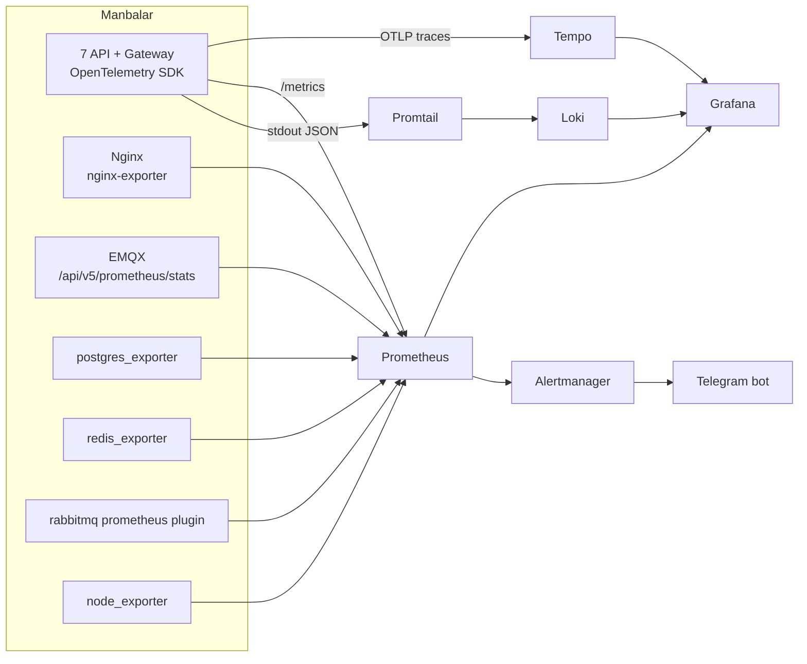

**Nega LGTM (Loki-Grafana-Tempo-Metrics), ELK emas:** Loki loglarni indekslamaydi (faqat label'larni) — Elasticsearch'ga qaraganda ~10× kam RAM/disk. Bitta VPS uchun bu hal qiluvchi. Bitta Grafana UI'da log → metrika → trace o'tish ("exemplar" bilan) tekshiruv vaqtini keskin qisqartiradi.

**Yengilroq alternativa:** faqat **Seq** (.NET dunyosida structured logging uchun eng qulay, bitta konteyner) + Prometheus/Grafana. Tracing'siz. Jamoa 1–2 kishi bo'lsa bu ham to'g'ri tanlov.

### 14.2 OpenTelemetry ulash

```csharp
// Infrastructure/Observability/ObservabilityExtensions.cs
public static IServiceCollection AddBotEnergyObservability(
    this IServiceCollection services, IConfiguration config, string serviceName)
{
    services.AddOpenTelemetry()
        .ConfigureResource(r => r.AddService(serviceName,
            serviceVersion: typeof(ObservabilityExtensions).Assembly.GetName().Version?.ToString()))
        .WithTracing(t => t
            .AddAspNetCoreInstrumentation(o =>
            {
                o.RecordException = true;
                o.Filter = ctx => !ctx.Request.Path.StartsWithSegments("/health");
            })
            .AddHttpClientInstrumentation()
            .AddEntityFrameworkCoreInstrumentation(o => o.SetDbStatementForText = false) // SQL'da PII bo'lishi mumkin
            .AddSource("BotEnergy.Mqtt")            // qo'lda yaratilgan span'lar
            .AddOtlpExporter())
        .WithMetrics(m => m
            .AddAspNetCoreInstrumentation()
            .AddHttpClientInstrumentation()
            .AddRuntimeInstrumentation()
            .AddMeter("BotEnergy")                  // biznes metrikalar
            .AddPrometheusExporter());
    return services;
}
```

**MQTT trace'ni HTTP trace bilan bog'lash.** Eng qimmatli narsa — "mobil `Process.Start` bosdi → qurilma javob berdi" zanjirini bitta trace'da ko'rish. Envelope'ga `traceparent` maydonini qo'shing:

```csharp
// Buyruq yuborishda (MqttDeviceCommandPublisher)
envelope.TraceParent = Activity.Current?.Id;

// Javob kelganda (DeserializeMiddleware'dan keyin)
using var activity = MqttActivitySource.StartActivity(
    $"mqtt {context.Kind}", ActivityKind.Consumer, parentId: envelope.TraceParent);
activity?.SetTag("device.serial", context.SerialNumber);
```

### 14.3 Kuzatiladigan metrikalar

**Oltin signallar (har servis uchun):**

| Metrika | Manba | Alert chegarasi |
|---|---|---|
| `http_server_request_duration_seconds` p95 | ASP.NET Core | > 1s, 5 daq |
| 5xx nisbati | Gateway | > 1%, 5 daq |
| 429 nisbati | Gateway | > 5% — limit noto'g'ri sozlangan yoki hujum |
| `process_working_set_bytes` | Runtime | > limit'ning 85% |
| `dotnet_gc_pause_ratio` | Runtime | > 5% |

**Biznes va infra metrikalari (o'ziga xos):**

| Metrika | Nega muhim | Alert |
|---|---|---|
| `botenergy_mqtt_messages_total{type,result}` | Pipeline qaysi bosqichda rad etayotgani | `result=hmac_fail` > 10/daq → hujum yoki firmware xatosi |
| `botenergy_mqtt_replay_rejected_total` | Counter buzilgan qurilmalar | > 0 → tekshirish (EEPROM flash?) |
| `botenergy_devices_online` | EMQX ulanishlar / DB'dagi qurilmalar | 10% pasayish 5 daqiqada → broker yoki tarmoq |
| `botenergy_sessions_active` | Biznes sog'lig'i | Kutilgan profildan keskin og'ish |
| `botenergy_session_stuck_total` | `InProcess` 2 soatdan ortiq | > 0 → qurilma javob bermayapti |
| `botenergy_hold_invoice_pending` | Hold watcher navbati | > 50 yoki o'sish trendi → Payme muammosi |
| `botenergy_outbox_lag_seconds` | Outbox publisher orqada qolishi | > 60s |
| `signalr_connections_current` | Real-time sog'liq | Keskin tushish → gateway/WS muammosi |
| `emqx_connections_count` | Broker | Kutilgan qurilma sonidan past |
| `pg_stat_activity_count` | Postgres | > `max_connections`ning 80% |
| `redis_memory_used_bytes` | Redis | > 80% (noeviction — to'lsa yozish to'xtaydi) |
| Sertifikat amal qilish muddati | blackbox_exporter | < 14 kun |

### 14.4 Loglash konvensiyasi

Docker'da Serilog **JSON** ga o'tadi:

```csharp
builder.Host.UseSerilog((ctx, lc) => lc
    .MinimumLevel.Information()
    .Enrich.FromLogContext()
    .Enrich.WithProperty("Service", apiName)
    .Enrich.With<TraceIdEnricher>()               // TraceId/SpanId → Loki↔Tempo bog'lanishi
    .WriteTo.Console(new Serilog.Formatting.Compact.CompactJsonFormatter()));
```

Har log yozuvida bo'lishi shart: `Service`, `TraceId`, `RequestId`, va tegishli bo'lsa `UserId`, `SessionId`, `DeviceSerial`. Bu Loki'da `{service="SessionApi"} | json | DeviceSerial="ESP-001"` kabi so'rovni mumkin qiladi.

**Log darajalari:**

| Daraja | Qachon | Misol |
|---|---|---|
| `Error` | Odam aralashuvi kerak | DB yiqildi, Payme 500 qaytardi |
| `Warning` | Kutilgan, lekin kuzatilishi kerak | HMAC fail, replay rad, sessiya timeout |
| `Information` | Biznes hodisa | Sessiya ochildi/yopildi, to'lov capture |
| `Debug` | Faqat diagnostikada | MQTT payload'lari |

`Warning` va yuqorisi Telegram'ga bormaydi — faqat **alert qoidalari** boradi (log spam ≠ alert).

### 14.5 Alert qoidalari (Alertmanager → Telegram)

| Alert | Shart | Jiddiylik |
|---|---|---|
| `ApiDown` | `up{job="botenergy"} == 0` 2 daq | 🔴 Critical |
| `HighErrorRate` | 5xx > 1% 5 daq | 🔴 Critical |
| `DatabaseDown` | `pg_up == 0` 1 daq | 🔴 Critical |
| `BrokerDown` | `emqx_connections_count` scrape fail 2 daq | 🔴 Critical |
| `DevicesDropped` | `botenergy_devices_online` 10 daqiqada 20% tushdi | 🔴 Critical |
| `CertExpiringSoon` | < 14 kun | 🟡 Warning |
| `DiskSpaceLow` | < 15% | 🟡 Warning |
| `HmacFailureSpike` | `rate(hmac_fail) > 10/min` | 🟡 Warning (xavfsizlik) |
| `OutboxLag` | > 60s 5 daq | 🟡 Warning |
| `HoldInvoiceBacklog` | pending > 50 | 🟡 Warning |

### 14.6 Grafana dashboardlari

1. **Platform Overview** — RPS, p95 latency, xato darajasi, servislar holati, CPU/RAM/disk.
2. **API Detail** — har endpoint bo'yicha latency heatmap, top-10 sekin endpoint, 4xx/5xx taqsimoti.
3. **Device & MQTT** — onlayn qurilmalar, xabar oqimi (turlari bo'yicha), pipeline rad etishlari, replay/HMAC xatolari, top-10 shovqinli qurilma.
4. **Business** — faol sessiyalar, o'rtacha sessiya davomiyligi, kunlik kWh, hold invoice voronkasi (created → captured → refunded).
5. **Infrastructure** — Postgres (ulanishlar, sekin so'rovlar, replikatsiya lag, jadval hajmlari), Redis, RabbitMQ queue chuqurligi.

---

## 15. Papka va loyiha strukturasi

```
BotEnergy/
├── BotEnergy.sln
│
├── Core/
│   ├── Domain/                          # entity, enum, interface, helper, Permissions
│   └── Application/                      # servis implementatsiyalari, DTO, validator
│
├── Infrastructure/
│   ├── Persistence/                      # AppDbContext, repository, migration, DataSeeder
│   ├── CommonConfiguration/              # DI extension, filter, middleware, config loader
│   │   └── ConfigurationFile/
│   │       ├── Configuration.json                 # Hosting/portlar + ReverseProxy (§4.7)
│   │       ├── Configuration.Development.json
│   │       └── Configuration.Production.json      # FAQAT Env_* placeholderlar
│   ├── DeviceMessaging/          ★ YANGI  # transportdan mustaqil envelope + pipeline (§8.2)
│   │   ├── Abstractions/ Envelopes/ Middlewares/ Handlers/ Dispatching/
│   └── Messaging.RabbitMq/       ☆ KELAJAK # MassTransit wiring, Outbox, consumer bazasi (§7)
│   #  Observability — alohida loyiha O'RNIGA CommonConfiguration/Observability/ ichida:
│   #  uni barcha 9 loyiha allaqachon referens qiladi, alohida loyiha 9 ta
│   #  ProjectReference qo'shishni talab qilardi.
│
├── WebApi/
│   ├── Gateway/                  ★ YANGI  # YARP — yagona public HTTP kirish
│   │   ├── Program.cs
│   │   ├── Middlewares/AuditLoggingMiddleware.cs
│   │   ├── Extensions/{RateLimiting,Swagger}Extensions.cs
│   │   └── Dockerfile
│   ├── AuthApi/  UserApi/  AdminApi/  BillingApi/  PaymentApi/  DeviceApi/
│   ├── SessionApi/
│   │   ├── Mqtt/                          # faqat MQTT ADAPTERI qoladi
│   │   │   ├── Transport/{MqttHost,MqttConnection,MqttPublisher}.cs
│   │   │   ├── Topics/MqttTopics.cs
│   │   │   └── MqttTransportAdapter.cs
│   │   ├── Hubs/SessionHub.cs
│   │   └── Services/
│   ├── TcpGateway/               ☆ KELAJAK  # xom TCP transport adapteri (§8.3)
│   └── Migrator/                 ★ YANGI    # migration'ni bir marta qo'llovchi konsol ilova
│
├── deploy/                       ★ YANGI
│   ├── docker-compose.yml
│   ├── docker-compose.observability.yml
│   ├── nginx/{botenergy.conf, snippets/proxy-common.conf}
│   ├── emqx/emqx.conf
│   ├── rabbitmq/definitions.json
│   ├── prometheus/{prometheus.yml, rules/botenergy.yml}
│   ├── grafana/dashboards/
│   ├── loki/{loki.yml, promtail.yml}
│   └── scripts/{backup.sh, restore-drill.sh, cert-deploy-hook.sh}
│
├── docs/
│   ├── PRODUCTION_ARCHITECTURE.md         # ← shu hujjat
│   ├── RUNBOOK.md                ★ YANGI  # incident javob protsedurasi
│   └── adr/                      ★ YANGI  # 0001-yarp-gateway.md, 0002-emqx.md, ...
│
├── .github/workflows/deploy.yml
├── CLAUDE.md   README.md   PROMTS.md   functional_specification.md
```

`★` — yangi qo'shiladi, `☆` — kelajakda.

---

## 16. Texnologiya stack'i — yakuniy ro'yxat

| Qatlam | Texnologiya | Versiya | Litsenziya |
|---|---|---|---|
| Runtime | .NET | 8 LTS (2026-11 gacha) → **10 LTS ga reja** | MIT |
| Web framework | ASP.NET Core | 8 | MIT |
| Gateway | YARP | 2.x | MIT |
| Edge proxy | Nginx | 1.25+ | BSD-2 |
| MQTT broker | EMQX OSS | 5.x | Apache 2.0 |
| MQTT klient | MQTTnet | 4.x | MIT |
| Message broker | RabbitMQ (+ MassTransit) | 3.13 | MPL 2.0 |
| DB | PostgreSQL + PostGIS | 16 / 3.4 | PostgreSQL Lic. |
| ORM | EF Core + Npgsql + NetTopologySuite | 8 | MIT |
| Cache/state | Redis + StackExchange.Redis | 7.x | BSD-3 (Redis 7.2 ostida) |
| Real-time | SignalR + Redis backplane | 8 | MIT |
| Logging | Serilog → Loki | 3.x | Apache 2.0 |
| Metrics | OpenTelemetry → Prometheus | 1.9+ | Apache 2.0 |
| Tracing | OpenTelemetry → Tempo | 1.9+ | Apache 2.0 |
| Dashboard | Grafana | 11.x | AGPL 3.0 |
| Konteyner | Docker + Compose v2 | 24+ | Apache 2.0 |
| CI/CD | GitHub Actions + GHCR | — | — |
| Sertifikat | Let's Encrypt + certbot | — | — |

> **Redis litsenziya eslatmasi:** Redis 7.4+ RSALv2/SSPL ga o'tdi. Sizning ishlatish stsenariyingizda (o'z ilovangiz uchun ichki cache) muammo yo'q, lekin xohlasangiz **Valkey** (Linux Foundation fork, BSD, to'liq mos) ga bir buyruq bilan o'tish mumkin.

> **.NET 8 → 10:** .NET 8 LTS qo'llab-quvvatlashi 2026-noyabrda tugaydi. .NET 10 LTS ga ko'chishni **2026-yil oxirigacha** rejalashtiring — bu ko'p hollarda `TargetFramework` o'zgartirish + paket yangilash bilan cheklanadi.

---

## 17. Har bir arxitektura qarorining asosi

| # | Qaror | Alternativalar | Nega shu tanlandi |
|---|---|---|---|
| 1 | **YARP gateway** | Ocelot, Kong, Traefik, APISIX | .NET jamoasi uchun bir xil til/ekotizim; konfiguratsiya kod bilan bir repo'da; mavjud `AddJwtAuthentication`, `PermissionFilter`, `AddSimulatorCors` extension'lari qayta ishlatiladi; Ocelot faol rivojlanmayapti; Kong/APISIX — Lua/plugin ekotizimi, jamoa uchun yangi til |
| 2 | **Nginx + YARP birga** | Faqat YARP; faqat Nginx | Nginx: certbot, TLS, statik, edge limit; YARP: biznes-kontekstli routing. YARP deploy paytida restart bo'lganda 443 tirik qoladi |
| 3 | **Servis-prefiksli URL** (`/api/{servis}/...`) | Birinchi segment bo'yicha routing; subdomen har servisga | Controller nomlari servislar orasida takrorlanadi (`DeviceController` 2 joyda, `PaymentController` 2 joyda) → boshqa yo'l bilan noaniqlik hal bo'lmaydi; subdomen har servisga = 7 ta sertifikat + CORS jahannami |
| 4 | **JWT chekkada + servisda ikki marta** | Faqat chekkada | Ichki tarmoqqa kirgan hujumchi to'g'ridan-to'g'ri servisga so'rov yubora olmasin; `PermissionFilter` va `AccessScope` baribir servisda kerak — gateway route'dan permission'ni bilmaydi |
| 5 | **EMQX** | Mosquitto, VerneMQ, HiveMQ CE | Bitta brokerda TCP+TLS+WS+WSS; HTTP authn/authz hook (o'z DB'ingiz); shared subscription (masshtab uchun majburiy); klaster yo'li; Prometheus |
| 6 | **Shared subscription** | Har instansiya hamma xabarni oladi + distributed lock | Lock — har xabarda Redis round-trip; shared subscription brokerning o'zida bepul taqsimlaydi |
| 7 | **Per-device MQTT credential** | Umumiy credential (hozirgi) + faqat HMAC | Bitta qurilmani ochgan odam butun parkni impersonatsiya qila oladi; ACL topic izolyatsiyasi beradi. HMAC — ikkinchi qatlam, birinchisining o'rnini bosmaydi |
| 8 | **8883 alohida port** | Hammasini 443'da ALPN bilan | Xom MQTT — HTTP emas, path yo'q → L7 path routing imkonsiz. ALPN ishlaydi, lekin murakkab; 8883 — IANA standarti, ESP32'da sodda |
| 9 | **MQTT ≠ RabbitMQ rollari** | RabbitMQ'ni device buyruqlariga qaytarish | Loyiha uni ataylab olib tashlagan — MQTT to'g'ridan-to'g'ri tezroq va soddaroq. RabbitMQ faqat servislararo ish uchun, real ehtiyoj paydo bo'lganda |
| 10 | **SignalR Redis backplane hozir** | Ikkinchi replika qo'shilganda | Backplane'siz ikkinchi replika **jimgina** noto'g'ri ishlaydi — xabar yetmaydi, xato ham chiqmaydi. Oldindan yoqish — 3 qator kod |
| 11 | **Docker Compose, K8s emas** | Kubernetes, Nomad, systemd (hozirgi) | 1–3 node va 1–3 dev uchun K8s'ning operatsion narxi foydasidan katta; systemd — izolyatsiya va reproducible deploy yo'q |
| 12 | **Build CI'da, prodda emas** | Hozirgi `deploy.sh` | Prod mashinasida SDK va build yuki bo'lmasligi; artifact versiyalanishi (git sha); rollback = TAG o'zgartirish |
| 13 | **Migration alohida job** | Har servis bootda avtomatik (hozirgi) | 7 servis parallel `MigrateAsync()` → lock kutishi/deadlock. Alohida job = bitta ishlovchi, deterministik tartib |
| 14 | **Telemetriya batch + partition** | Har xabarda alohida INSERT | 200 tranzaksiya/s → 1/s; 3.5 GB/kun o'sishda `DELETE` bilan tozalash imkonsiz, `DETACH PARTITION` — bir zumda |
| 15 | **LGTM stack** | ELK, Datadog, New Relic | Loki ~10× kam resurs (bitta VPS uchun hal qiluvchi); Datadog/NR — oylik xarajat va ma'lumot chetga chiqadi |
| 16 | **RS256 ga o'tish (bosqich 2)** | HS256'da qolish | Hozir 8 ta jarayon imzolash kalitini biladi; bittasi buzilsa istalgan admin token yasaladi |
| 17 | **`/health/live` va `/ready` ajratish** | Bitta `/health` (hozirgi) | DB sekinlashganda barcha servislarni restart qilish vaziyatni yomonlashtiradi |
| 18 | **`noeviction` Redis policy** | `allkeys-lru` | LRU MQTT replay counter'ini jimgina o'chirishi mumkin → xavfsizlik nazorati yo'qoladi |

---

## 18. Risklar va trade-off'lar

### 18.1 Arxitektura risklari

| # | Risk | Ehtimollik | Ta'sir | Yumshatish |
|---|---|---|---|---|
| R1 | **Bitta VPS — yagona ishlamay qolish nuqtasi.** Mashina o'lsa hamma narsa o'ladi | O'rta | 🔴 Yuqori | PITR backup (RPO ~5 daq), IaC bilan qayta yaratish protsedurasi, RTO o'lchangan; Bosqich 2'da data node ajratiladi |
| R2 | **Nginx + YARP = ikkita proxy hop.** Qo'shimcha ~1–3 ms va konfiguratsiya ikki joyda | Yuqori | 🟢 Past | Ongli trade-off; timeout/header sozlamalari `deploy/` da bir joyda hujjatlashtirilgan |
| R3 | **Gateway yangi yagona nuqta.** YARP yiqilsa butun REST/SignalR o'ladi | O'rta | 🔴 Yuqori | Gateway'da biznes logika **yo'q** (kam o'zgaradi → kam buziladi); 2 replika; Nginx `proxy_next_upstream`; `/health/live` monitoring |
| R4 | **PostgreSQL telemetriya o'sishi.** 3.5 GB/kun | Yuqori | 🟠 O'rta | Batch + partition + 90 kunlik retention; disk alert 15% |
| R5 | **Sirlar allaqachon oshkor** (git'da) | **Sodir bo'lgan** | 🔴 Yuqori | Darhol rotatsiya, git history tozalash, `git-secrets` hook |
| R6 | **`Otp:AllowTestCode: true` prodda** — `123456` bilan istalgan akkauntga kirish | **Sodir bo'lgan** | 🔴 Kritik | Darhol `false` |
| R7 | **MQTT umumiy credential** | Mavjud | 🟠 O'rta | §6.4 migratsiya; HMAC vaqtincha ushlab turadi |
| R8 | **EMQX klaster tajribasi yo'q.** Erlang/OTP debug qilish o'ziga xos | Past | 🟠 O'rta | Bosqich 3 gacha bitta node; vertikal masshtab ancha uzoq yetadi; managed EMQX Cloud — zaxira variant |
| R9 | **`.NET 8` LTS 2026-11 da tugaydi** | Aniq | 🟠 O'rta | 2026-yil oxirigacha .NET 10 LTS ga ko'chish rejaga kiritilgan |
| R10 | **Migration avtomatik qo'llanishi** — noto'g'ri migration prodga jimgina chiqadi | O'rta | 🔴 Yuqori | Migration alohida job; staging'da avval sinash; destructive migration'lar uchun qo'lda tasdiq |
| R11 | **Testlar yo'q** (repoda umuman) | Aniq | 🔴 Yuqori | Kritik yo'llarga (auth, balans, hold invoice, MQTT pipeline) integration test; bu refaktoringlarni xavfsiz qiladi |
| R12 | **Payme integratsiyasi to'liq emas** (`MerchantId`/`Key` bo'sh) | Mavjud | 🟠 O'rta | Prod credential'lar env var orqali; sandbox'da to'liq sinov |
| R13 | **Cloudflare MQTT'ni himoya qilmaydi** — origin IP oshkor | O'rta | 🟠 O'rta | EMQX conn rate limit; provayder DDoS himoyasi; kerak bo'lsa CF Spectrum |

### 18.2 Ongli trade-off'lar

| Trade-off | Nima yutamiz | Nima yo'qotamiz | Nega maqbul |
|---|---|---|---|
| Compose, K8s emas | Sodda operatsiya, tez o'rganish | Auto-scaling, self-healing chegaralari | Yuk bashorat qilinadigan; 3 node'gacha yetadi |
| Bitta PostgreSQL (barcha servislar) | Tranzaksion yaxlitlik, JOIN, sodda migration | "Haqiqiy" mikroservis izolyatsiyasi yo'q, DB umumiy bog'liqlik | Loyiha allaqachon shunday; bu domen uchun to'g'ri (sessiya↔to'lov↔balans qattiq bog'langan) |
| Gateway'da JWT, servisda ham | Ikki qatlam himoya | Har so'rovda ikki marta imzo tekshiruvi (~0.1 ms) | Narx amalda nolga teng |
| MQTT QoS 1 (QoS 2 emas) | Yuqori o'tkazuvchanlik | Takroriy yetkazish mumkin | Envelope'dagi monoton `id` idempotentlikni allaqachon ta'minlaydi |
| Telemetriyada QoS 0 | Eng past latency | Xabar yo'qolishi mumkin | Telemetriya — oqim; keyingi namuna 5 soniyada keladi |
| Local time (`DateTime.Now`) | Loyiha konvensiyasi, hisobotlar oddiy | Ko'p mintaqali kengayishda muammo | Ongli loyiha qarori; O'zbekiston bitta vaqt zonasi |
| Soft delete (hard delete yo'q) | Audit tarixi, tiklash | Jadval o'sishi, har so'rovda filter | Moliyaviy/IoT domenda audit muhimroq. **Istisno:** telemetriya partition drop (§11.4) |

---

## 19. Kelajakdagi kengayish strategiyasi

### 19.1 Kengayish o'qlari

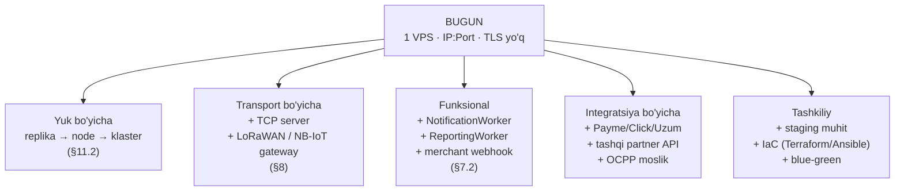

Har o'q **mustaqil** — biri boshqasini qayta loyihalashni talab qilmaydi. Buni ta'minlaydigan uchta qaror: (1) gateway routing tablitsasi konfiguratsiyada, (2) device messaging transportdan ajratilgan, (3) hodisalar exchange orqali, to'g'ridan-to'g'ri HTTP chaqiruv orqali emas.

### 19.2 Aniq kengayish stsenariylari

| Stsenariy | Nima qilinadi | Nima o'zgarmaydi |
|---|---|---|
| Yangi mikroservis (masalan, `NotificationApi`) | `Configuration.json` ga 1 ta route + 1 ta cluster; compose'ga 1 ta servis | Boshqa hech narsa — mobil ilova, boshqa servislar |
| Servisdan 2-replika | `docker compose up --scale`; YARP destination ro'yxatiga qo'shish | Kod (agar §11.5 tayyorgarliklari qilingan bo'lsa) |
| TCP transport | `WebApi/TcpGateway` + 1 port | Pipeline, handlerlar, biznes servislar, DB |
| OCPP 1.6/2.0.1 qo'llab-quvvatlash | Yangi `OcppGateway` (WebSocket-asosli) — `IDeviceTransport` adapteri | Envelope ichki modeli, handlerlar |
| Ikkinchi to'lov provayderi (Click) | `IPaymentProvider` implementatsiyasi + PaymentApi route | Hold invoice oqimi, sessiya logikasi |
| Yangi mamlakat / ko'p mintaqa | Timezone modelini qayta ko'rib chiqish (**bu qimmat** — §18.2), CDN, mintaqaviy broker | Gateway, auth modeli |
| Mobil ilova v2 | Gateway'da `/api/v2/...` route guruhi, eski v1 parallel ishlaydi | Backend versiyalash strategiyasi |

### 19.3 API versiyalash — hozir tayyorlab qo'yish

Mobil ilova versiyalari yillar davomida ishlatiladi. Versiyalashni **gateway darajasida** qo'ying:

```
/api/v1/{servis}/...   → hozirgi servislar
/api/v2/{servis}/...   → yangi versiya (yangi deployment yoki bir xil servis, boshqa controller)
```

Hozir bu bitta qo'shimcha route transform. Keyinroq qo'shish — barcha klientlarni sindirish. **Tavsiya: birinchi kundanoq `/api/v1/` bilan chiqing.**

---

## 20. Implementatsiya yo'l xaritasi

| Bosqich | Ish | Kutilgan vaqt | Bog'liqlik |
|---|---|---|---|
| **0. Favqulodda** | Sirlarni rotatsiya, `AllowTestCode: false`, `Seed:AdminPassword` env'ga, git history tozalash | 0.5 kun | — |
| **1. TLS + domen** | DNS, certbot, Nginx, `Hosting:UseHttps`, CORS allowlist yangilash | 1 kun | 0 |
| **2. Gateway** | `WebApi/Gateway` loyihasi, route jadvali, audit middleware, rate limit, Swagger agg. | 3–4 kun | 1 |
| **3. Servislarni yopish** | Backend portlarni `127.0.0.1`/docker net'ga; ufw; mobil ilovada base URL almashtirish | 1 kun | 2 |
| **4. Health split** | `/health/live` + `/health/ready`; YARP active health check | 0.5 kun | 2 |
| **5. Docker** | 8 ta Dockerfile, compose, env fayl, Migrator konsol ilovasi | 3 kun | 3 |
| **6. CI/CD** | GHCR build matrix, migration job, `--wait` gate, rollback | 2 kun | 5 |
| **7. Observability** | OTel wiring, Serilog JSON, LGTM compose, dashboardlar, alertlar | 3–4 kun | 5 |
| **8. EMQX** | Mavjud brokerdan EMQX'ga o'tish, listener'lar, `/mqtt` WSS, authn/authz hook | 3 kun | 1, 5 |
| **9. Per-device MQTT auth** | `MqttPasswordHash` migration, hook endpointlari, bosqichma-bosqich qurilma o'tkazish | 3 kun + dala | 8 |
| **10. Masshtab tayyorgarligi** | SignalR backplane, unikal ClientId + shared subscription, OTP → Redis, watcher lock | 2–3 kun | 5 |
| **11. Telemetriya optimizatsiyasi** | Batch writer, partitioning, retention job | 3 kun | 5 |
| **12. Xavfsizlik bosqich 2** | RS256, issuer validation, per-servis internal secret | 2 kun | 2 |
| **13. Backup** | PITR sozlash, kunlik dump, choraklik restore mashqi | 1–2 kun | 5 |
| **14. DeviceMessaging refaktoring** | Pipeline'ni transportdan ajratish | 2–3 kun | 10 |
| **15. RabbitMQ** | §7.2 trigger'i paydo bo'lganda: MassTransit, outbox, birinchi consumer | 3–4 kun | 5 |

Umumiy: **~35 ish kuni** (1 dev), 0–7 bosqichlar (~14 kun) minimal production-ready holatni beradi.

### 20.1 Kritik yo'l

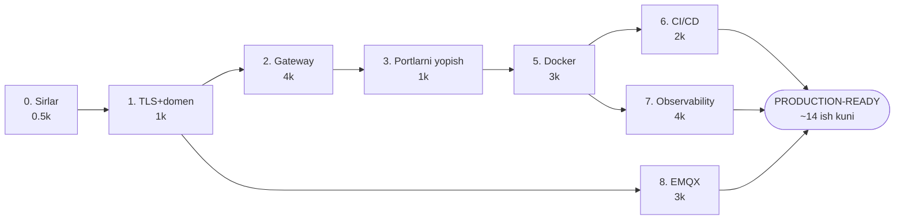

---

## 21. Xulosa

Dizayn quyidagi tamoyillarga tayanadi:

1. **Yagona public yuza.** `company.uz` — 443 (HTTP oilasi) va 8883 (xom MQTT). Boshqa hech qanday port tashqariga chiqmaydi.
2. **Chekkada autentifikatsiya, ichkarida avtorizatsiya.** Gateway kimligini tekshiradi, servis nima qila olishini hal qiladi. Ikkalasi ham bo'ladi.
3. **Bitta broker, ko'p transport.** EMQX'da topic space transportdan mustaqil — talab avtomatik bajariladi.
4. **Transport pipeline'dan ajratilgan.** TCP, OCPP yoki boshqa protokol — yangi adapter, eski biznes logika.
5. **Rollarni aralashtirmaslik.** MQTT — qurilma bilan; RabbitMQ — servislar orasida; Redis — holat; Postgres — haqiqat manbai.
6. **Masshtab uchun oldindan tayyorgarlik, lekin oldindan murakkablik emas.** Backplane va shared subscription hozir (arzon, keyin qimmat); K8s va klaster — trigger paydo bo'lganda.
7. **Har qaror qaytarilishi mumkin.** Nginx'ni olib tashlash, brokerni almashtirish, K8s'ga o'tish — hech biri qolgan arxitekturani qayta loyihalashni talab qilmaydi.

